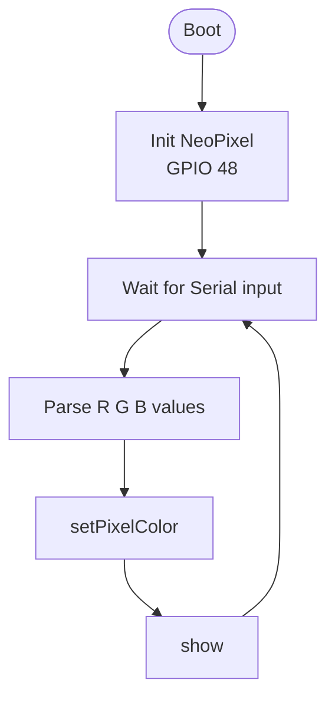
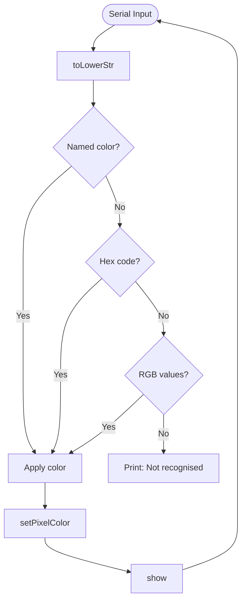
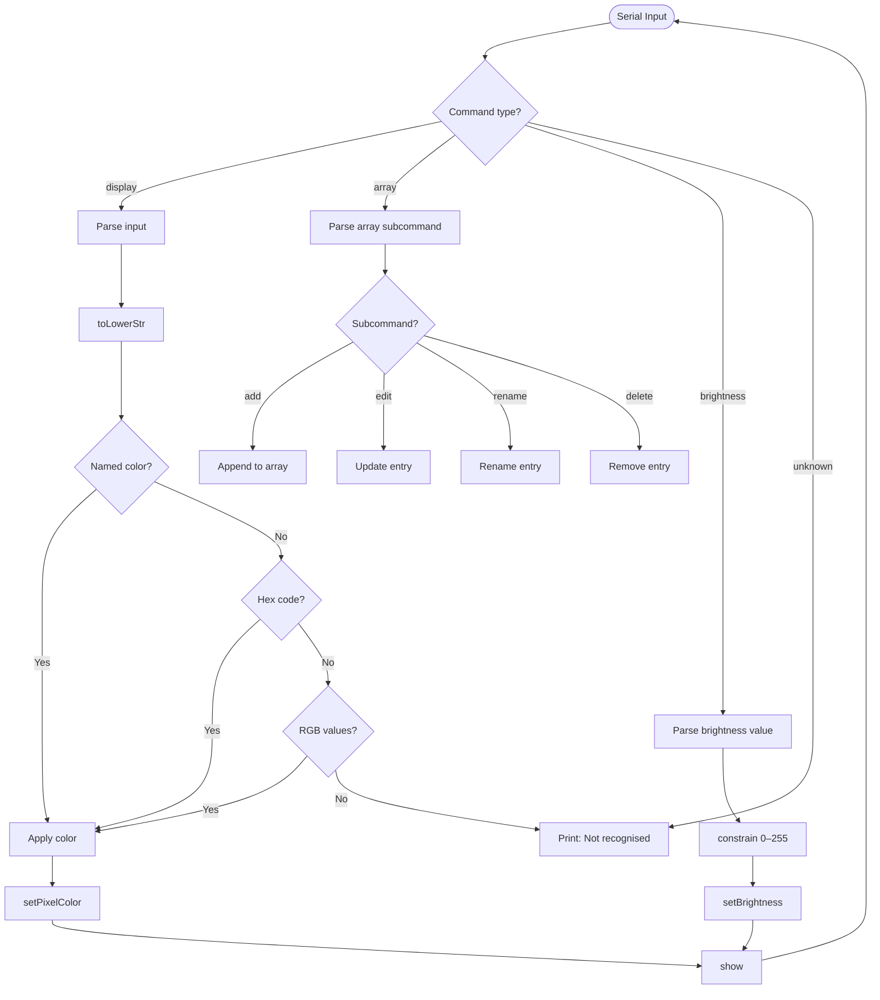

# 💡 Light Control Engine

A lightweight RGB lighting control engine for the ESP32-S3, operated entirely through a Serial interface.

---

## 📋 Table of Contents
- [Overview](#overview)
- [Version 1.0](#-version-10--basic-rgb-control)
- [Version 2.0](#-version-20--named-colors--hex-support)
- [Version 3.0](#-version-30--brightness--cli)
- [Configuration](#️-configuration)
- [Dependencies](#-dependencies)

---

## Overview

The ESP32-S3 onboard RGB LED is driven by a **single pin (GPIO 48)** using the NeoPixel protocol — no separate R/G/B pins required.

RGB color is represented by three channels, each ranging from `0` to `255`:

| Channel | Range | Description |
| --- | --- | --- |
| R | 0–255 | Red |
| G | 0–255 | Green |
| B | 0–255 | Blue |

Combined, this yields **16,777,216** possible colors (`256 × 256 × 256`).

The two core calls that drive the LED:

```cpp
led.setPixelColor(0, led.Color(r, g, b));  // stage the color
led.show();                                 // apply it physically
```

---

## 🔴 Version 1.0 — Basic RGB Control

The first version establishes the foundation: read RGB values from Serial and apply them to the onboard LED.

**Input format:**
```
255 0 128
```

<details>
<summary>Flowchart view</summary>



</details>

---

## 🎨 Version 2.0 — Named Colors & Hex Support

### Named Color Array

Instead of typing raw RGB codes, you can now input color names directly. Colors are mapped in a struct array:

```cpp
NamedColor colors[] = {
  {"red",     255, 0,   0  },
  {"green",   0,   255, 0  },
  {"blue",    0,   0,   255},
  // add more as needed
};
```

> [!TIP]
> You can extend the array with any custom color. Just follow the pattern — name, R, G, B.

### Hex Support

Standard hex color codes are also accepted:

```
#FF5500
#00FF88
```

### Case-Insensitive Input

All input is normalized to lowercase before parsing, so any of these work:

```
red / Red / RED / ReD
```

<details>
<summary>toLowerStr implementation</summary>

```cpp
void toLowerStr(char* str) {
  for (int i = 0; str[i]; i++) {
    if (str[i] >= 'A' && str[i] <= 'Z') str[i] += 32;
  }
}
```

</details>

### Input Priority

When a command is received, the parser follows this resolution order:

```
named color → hex code → raw RGB values → "Not recognised"
```

<details>
<summary>Flowchart view</summary>



</details>

---

## 🔆 Version 3.0 — Brightness & CLI

### Brightness Control

Brightness is handled by the NeoPixel library directly, independent of the color channels.

> [!NOTE]
> Brightness and color are separate concerns. `setBrightness(100)` with `(255, 255, 255)` keeps the color value intact for future reference, unlike manually scaling down the RGB values.

**Input format:**
```
brightness 180
```

<details>
<summary>Brightness implementation</summary>

```cpp
if (!found && strncmp(input, "brightness ", 11) == 0) {
  int val = atoi(input + 11);
  val = constrain(val, 0, 255);
  rgbLed.setBrightness(val);
  rgbLed.show();
  Serial.print("Brightness set to: ");
  Serial.println(val);
  found = true;
}
```

</details>

> [!WARNING]
> Brightness values are not persisted across resets. The LED returns to default brightness on reboot.

### CLI Commands

> [!WARNING]
> Commands are case-sensitive and do not use the same normalisation as color names. Type them exactly as shown.

| Command | Arguments | Description |
| --- | --- | --- |
| `display` | rgb code, hex code or name | Set the LED color |
| `array add` | name r g b | Add a new named color |
| `array edit` | name r g b | Edit an existing color |
| `array rename` | old-name new-name | Rename a color entry |
| `array delete` | name | Remove a color from the array |

> [!IMPORTANT]
> Full CLI reference is documented in a separate file.

<details>
<summary>Full input flowchart</summary>



</details>

---

## ⚙️ Configuration

```cpp
#define LED_PIN        48     // Onboard NeoPixel pin
#define LED_COUNT      1      // Number of LEDs
#define BAUD_RATE      115200 // Serial baud rate
#define DEFAULT_BRIGHT 50     // Initial brightness (0–255)
```

> [!CAUTION]
> Setting brightness above 200 for extended periods may cause the onboard LED to heat up. Keep it reasonable for continuous use.

---

## 📦 Dependencies

- [Adafruit NeoPixel](https://github.com/adafruit/Adafruit_NeoPixel) — LED driver

> [!IMPORTANT]
> Library versions are not pinned. If a dependency updates and breaks the build, lock versions in your package manager.

---

## 📄 License

MIT
