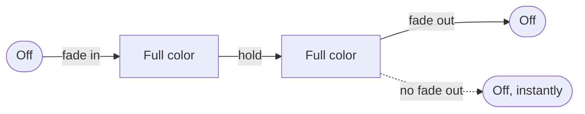
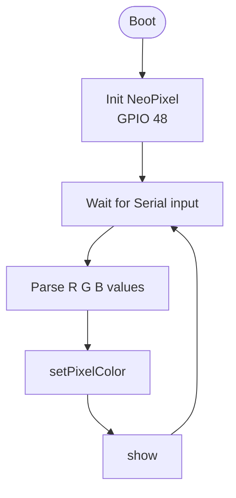
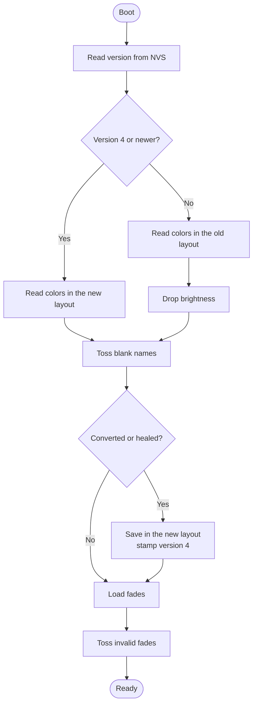
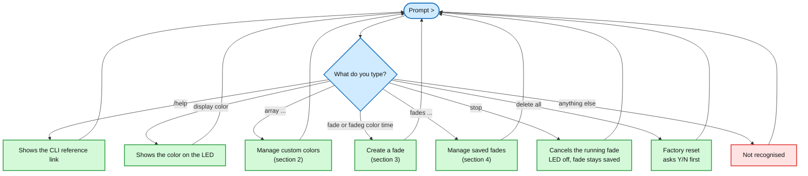
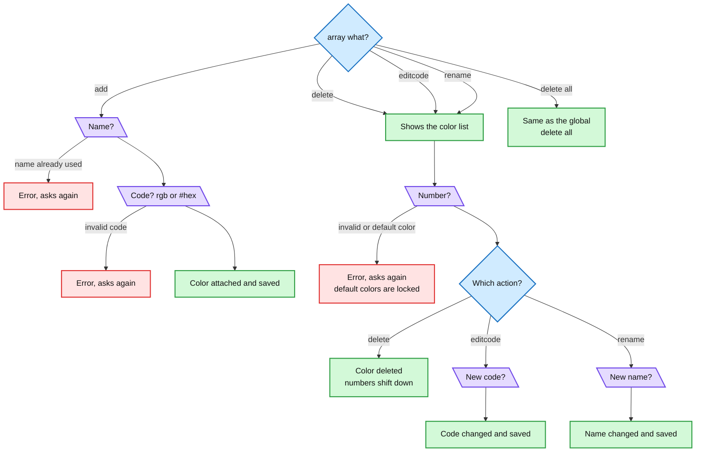
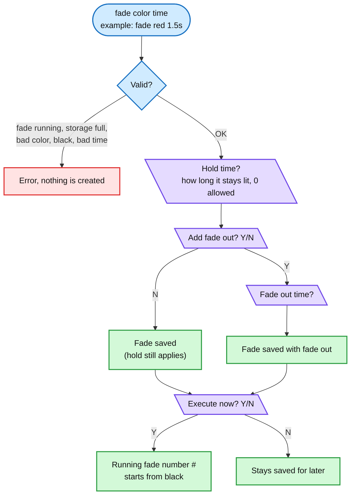
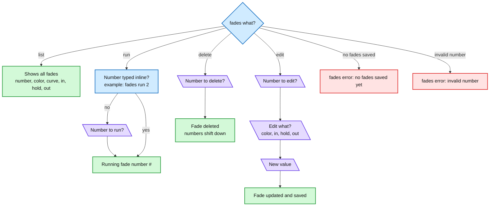
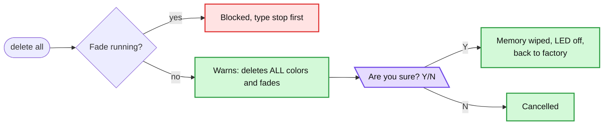

# 💡 Light Control Engine


> **A lightweight RGB lighting control engine for the ESP32-S3, operated entirely through a Serial interface.**

<picture>
  <source media="(prefers-color-scheme: dark)" srcset="https://github.com/user-attachments/assets/adacb953-3634-4590-8384-f0e306ec3d3a">
  
</picture>

----

## 📑 Table of Contents

- [Overview](#overview)
- [Version 4.0 — Fades](#-version-40--fades)
- [Configuration](#%EF%B8%8F-configuration)
- [Dependencies](#-dependencies)
- [Roadmap](#roadmap)
- [Contributing](#contributing)
- [License](#license)

---

## Overview

The ESP32-S3 onboard RGB LED is driven by a **single pin (GPIO 48)** using the NeoPixel protocol — no separate R/G/B pins required.

RGB color is represented by three channels, each ranging from `0` to `255`:

| Channel | Range | Description |
| ------- | ----- | ----------- |
| R       | 0–255 | Red         |
| G       | 0–255 | Green       |
| B       | 0–255 | Blue        |

Combined, this yields **16,777,216** possible colors (`256 × 256 × 256`).

The two core calls that drive the LED:

```c++
led.setPixelColor(0, led.Color(r, g, b));  // stage the color
led.show();                                 // apply it physically
```

---
> [!NOTE]
> I removed previous versions notes.
  
## 🌅 Version 4.0 — Fades

4.0 adds the **effects CLI**, starting with **fades**: the LED goes from off up to a color, stays lit for a while, and optionally goes back down to off. It also removes brightness completely.

### What's new

| Command  | Arguments                          | Description                                       |
| -------- | ---------------------------------- | ------------------------------------------------- |
| `fade`   | color, fade in time                | Create a fade with a normal (linear) curve        |
| `fadeg`  | color, fade in time                | Same as `fade`, with gamma correction             |
| `fades`  | `list`, `run`, `delete`, `edit`    | List and manage the saved fades                   |
| `stop`   | none                               | Cancel the running fade, LED off immediately      |

Also new: `display` and `array add` lost their brightness steps, and saved colors from 3.0 are migrated automatically.

### Creating a fade

```
fade [name | rgb(r g b) | #hex] [fade in time]
```

The color is accepted exactly like `display`: a name, `rgb(r g b)` or `#hex`. The command line is split at the **last space**: the last word is the fade in time, everything before it is the color. That is why `rgb(255 0 128)` works even with spaces inside it.

```
> fade rgb(255 0 128) 2s
Hold time (how long it stays lit, e.g. 2s): 1s
Add fade out? Y/N: Y
Fade out time: 1.5s
fade successfully created, saved by number 0
Execute now? Y/N: Y
Running fade number 0
```

Without a fade out:

```
> fade red 1.5s
Hold time (how long it stays lit, e.g. 2s): 2s
Add fade out? Y/N: N
fade successfully created as number 1
Execute now? Y/N: N
```

> [!NOTE]
> The hold time is asked right after the command and **before** "Add fade out?". If you answer `N` to the fade out, the hold still applies: fade in → hold → the LED turns off instantly.

`back` and `esc` work in every prompt of the flow, same as the rest of the CLI.

<details>
<summary><b>Creation flowchart</b></summary>


```mermaid
flowchart TD
    A([fade / fadeg color time]) --> B{Fade running?}
    B -->|Yes| BUSY[Print: led busy\ntype stop to cancel it]
    B -->|No| C{Color and time valid?\nstorage not full?}
    C -->|No| ERR[Print: fade error]
    C -->|Yes| D[Ask: Hold time]
    D --> E{Add fade out? Y/N}
    E -->|Y| F[Ask: Fade out time]
    F --> G[Save fade to NVS/Preferences]
    G --> H[Print: fade successfully created,\nsaved by number #]
    E -->|N| I[Save fade to NVS/Preferences]
    I --> J[Print: fade successfully created\nas number #]
    H --> K{Execute now? Y/N}
    J --> K
    K -->|Y| L[Print: Running fade number #\nfade runs in the background]
    K -->|N| M([Back to prompt\nfade stays saved])
    L --> M
    BUSY --> M
    ERR --> M
```

</details>

### Fade shape


```mermaid
flowchart LR
    A([Off]) -->|fade in| B[Full color]
    B -->|hold| C[Full color]
    C -->|fade out| D([Off])
    C -.->|no fade out| E([Off, instantly])
```

| Phase    | What happens                                          | Time                |
| -------- | ----------------------------------------------------- | ------------------- |
| Fade in  | Always starts from black, goes up to the color        | typed in the command |
| Hold     | LED stays at full color                               | asked after the command (can be `0s`) |
| Fade out | Color goes back down to black (optional)              | asked if you answer `Y` |

> [!NOTE]
> You can't fade to black (`off`, `rgb(0 0 0)`, `#000000`). There is nothing to fade to, so it returns an error.

### Time format

Times **need a suffix**: `1.5s` or `1500ms`. No suffix is an error.

| Input    | Result                              |
| -------- | ----------------------------------- |
| `1.5s`   | 1500 ms                             |
| `1500ms` | 1500 ms                             |
| `2s`     | 2000 ms                             |
| `2`      | error: invalid time (no suffix)     |
| `3601s`  | error: time too long (max `3600s`)  |

The max time is **3600s (1h)** per phase. Fade in and fade out can't be `0`; hold can.

### Gamma correction

`fade` uses a normal (linear) curve, `fadeg` uses gamma correction. Same flow, same prompts, same saving — only the curve changes, and it is saved with the fade.

<details>
<summary><b>Flowchart view</b></summary>


```mermaid
flowchart TD
    A([Boot]) --> B[Init NeoPixel\nGPIO 48]
    B --> C[Wait for Serial input]
    C --> D[Parse R G B values]
    D --> E[setPixelColor]
    E --> F[show]
    F --> C
```
linear: level = t
gamma:  level = t ^ 2.2
```

`level` goes from `0` to `1` during the fade in (and back down during the fade out), and each channel is `color × level`. The exponent is `FADE_GAMMA` in the code.

> [!TIP]
> Human eyes don't see brightness linearly, so a linear fade tends to look like it lights up quickly and then barely changes. Try `fadeg` if that bugs you.

Gamma graph:

<picture>
  <source media="(prefers-color-scheme: dark)" srcset="https://github.com/user-attachments/assets/5942a7c6-e956-4a36-b47f-62d092cf5b05">
  
</picture>

### Managing fades

```
fades [function]
```

| Function | Description                                                        |
| -------- | ------------------------------------------------------------------ |
| `list`   | Shows every saved fade: number, color, curve, in, hold and out     |
| `run`    | Runs a saved fade                                                  |
| `delete` | Deletes a saved fade                                               |
| `edit`   | Edits the color or one of the times of a saved fade                |

`run`, `delete` and `edit` accept the number inline (`fades run 2`) or ask for it (after showing the list).

```
> fades list
--- fade list ---
0. (255 0 128) linear | in 2s | hold 1s | out 1500ms
1. (255 0 0) linear | in 1500ms | hold 2s | out none
-----------------
```

`fades edit` asks what to edit: `color`, `in`, `hold` or `out`. For `out`, type `none` to remove the fade out. The curve can't be edited, it comes from the command that created the fade (`fade` or `fadeg`).

Fades are numbered from `0`, and the numbers **shift down** after a delete (same as the color array).

### Non-blocking engine and the stop/lock rule

The fade runs **in the background**: the CLI keeps working while the LED is animating. There is no timer or second task, the engine is stepped from the same loop that waits for your input (`fadeTick()` is called inside `readLine()`), so it ticks about once per millisecond while the CLI is idle or waiting at a prompt.

While a fade is running:

| Command                                                   | State                                    |
| --------------------------------------------------------- | ---------------------------------------- |
| `stop`                                                    | Cancels the fade                         |
| `display`, `fade`, `fadeg`, `fades run`, `delete all`     | **Blocked** until the fade ends or `stop` |
| `array add / delete / editcode / rename`, `fades list / delete / edit` | Work normally               |
| `esc`, `back`                                             | Navigation only, they do **not** cancel  |

Blocked commands return `led busy: a fade is running, type stop to cancel it`.

`stop` turns the LED off immediately and the fade **stays saved**. When a fade ends by itself, the LED turns off and nothing is printed.

> [!NOTE]
> The running fade is a copy. Deleting or editing the saved fade while it runs doesn't change the one that's playing.

<details>
<summary><b>Engine flowchart</b></summary>


```mermaid
flowchart TD
    A([Waiting for Serial input]) --> B[fadeTick]
    B --> C{Fade running?}
    C -->|No| D{Byte available?}
    C -->|Yes| E{Which phase?}
    E -->|fade in| F[level = t / in]
    E -->|hold| G[level = 1]
    E -->|fade out| H[level = 1 - t / out]
    E -->|over| I[LED off\nnothing printed]
    F --> J{gamma?}
    H --> J
    J -->|Yes| K[level = level ^ 2.2]
    J -->|No| L[Scale RGB by level]
    K --> L
    G --> L
    L --> M{Color changed?}
    M -->|Yes| N[setPixelColor + show]
    M -->|No| D
    N --> D
    I --> D
    D -->|No| A
    D -->|Yes| O[Read the line]
```

</details>

### Storage

Saved fades **persist** in NVS/Preferences, like the custom colors (namespace `lce`). They survive resets and reflashes, and `delete all` wipes them together with the colors.

| Item            | Limit / detail                          |
| --------------- | --------------------------------------- |
| Saved fades     | **30 max** (`MAX_FADES`), then `fade error: storage full` |
| Fade number     | Starts at `0`, shifts down after a delete |
| What is saved   | Color (RGB), curve, fade in, hold, fade out (if any) |
| Bad entries     | Invalid saved fades are tossed on boot (self healing) |

### ❌ Brightness removal

**Brightness was removed from the whole system in 4.0.** It only caused problems, so it is gone:

- no brightness field in the color struct
- no "Want to define brightness?" question in `display`
- no brightness step in `array add`
- no `brightness` command
- the LED always runs at fixed full brightness (`255`); a fade scales the RGB values from `0` up to the color

> [!TIP]
> **Want it dimmer? Use lower RGB values.** `rgb(255 0 0)` is full red, `rgb(60 0 0)` is a dim red, `rgb(20 20 20)` is a dim white. For a fade, pick the dimmer color and fade to that.

If you add default colors in the code, they are `{name, r, g, b}` now, without the 4th number the older examples had.

### 🔄 Migration from 3.0

Colors saved by 3.0 use the old layout (with brightness). **You don't lose them.** On the first boot of 4.0:

1. The old entries are read in the old layout.
2. They are converted to the new layout, the brightness just gets dropped.
3. Everything is saved again in the new layout and the storage is stamped as 4.0, so this only happens once.
4. If there were colors to convert, the boot prints `saved colors converted to the 4.0 layout, brightness dropped`.

Blank-name entries are still tossed during this step, same self healing as before.

<details>
<summary><b>Migration flowchart</b></summary>


```mermaid
flowchart TD
    A([Boot]) --> B[Read version from NVS]
    B --> C{Version 4 or newer?}
    C -->|Yes| D[Read colors in the new layout]
    C -->|No| E[Read colors in the old layout]
    E --> F[Drop brightness]
    D --> G[Toss blank names]
    F --> G
    G --> H{Converted or healed?}
    H -->|Yes| I[Save in the new layout\nstamp version 4]
    H -->|No| J[Load fades]
    I --> J
    J --> K[Toss invalid fades]
    K --> L([Ready])
```

</details>
<details><summary>Flowchart view</summary>

### CLI flowchart (4.0)

A simplified user view: what you type and what happens, not the internal code. The full internal flowchart is at the end of this section.

#### Rules

| Topic | Rule |
| ----- | ---- |
| Colors | Name (default or custom), `#hex`, or `rgb(r g b)` |
| Times | Always with a suffix: `1.5s` or `1500ms`. Max `3600s` |
| `esc` | Works in every prompt, goes back to the menu |
| `back` | Works in every prompt, goes one step back |
| Fade running | `display`, `fade`, `fadeg`, `fades run` and `delete all` are blocked. Type `stop` to cancel it |
| Limits | 20 custom colors, 30 saved fades |
| Fades | Always start from black. You can't fade to black. `fade` = linear, `fadeg` = gamma |
| Saved data | Custom colors and fades survive a reboot |

#### 1. Main menu


```mermaid
flowchart TD
    classDef cmd fill:#d0ebff,stroke:#1971c2,color:#111111,stroke-width:2px
    classDef out fill:#d3f9d8,stroke:#2f9e44,color:#111111,stroke-width:2px
    classDef err fill:#ffe3e3,stroke:#e03131,color:#111111,stroke-width:2px

    P(["Prompt >"]) --> C{"What do you type?"}
    C -->|"/help"| H["Shows the CLI reference link"]
    C -->|"display color"| D["Shows the color on the LED"]
    C -->|"array ..."| A["Manage custom colors<br/>(section 2)"]
    C -->|"fade or fadeg color time"| F["Create a fade<br/>(section 3)"]
    C -->|"fades ..."| FS["Manage saved fades<br/>(section 4)"]
    C -->|"stop"| S["Cancels the running fade<br/>LED off, fade stays saved"]
    C -->|"delete all"| W["Factory reset<br/>asks Y/N first"]
    C -->|"anything else"| U["Not recognised"]

    H --> P
    D --> P
    A --> P
    F --> P
    FS --> P
    S --> P
    W --> P
    U --> P

    class C,P cmd
    class H,D,A,F,FS,S,W out
    class U err
```

#### 2. Custom colors (`array`)


```mermaid
flowchart TD
    classDef cmd fill:#d0ebff,stroke:#1971c2,color:#111111,stroke-width:2px
    classDef ask fill:#e5dbff,stroke:#7048e8,color:#111111,stroke-width:2px
    classDef out fill:#d3f9d8,stroke:#2f9e44,color:#111111,stroke-width:2px
    classDef err fill:#ffe3e3,stroke:#e03131,color:#111111,stroke-width:2px

    A{"array what?"}

    A -->|"add"| A1[\"Name?"\]
    A1 -->|"name already used"| E1["Error, asks again"]
    A1 --> A2[\"Code? rgb or #hex"\]
    A2 -->|"invalid code"| E2["Error, asks again"]
    A2 --> A3["Color attached and saved"]

    A -->|"delete"| L1["Shows the color list"]
    A -->|"editcode"| L1
    A -->|"rename"| L1
    L1 --> N[\"Number?"\]
    N -->|"invalid or default color"| E3["Error, asks again<br/>default colors are locked"]
    N --> ACT{"Which action?"}
    ACT -->|"delete"| R1["Color deleted<br/>numbers shift down"]
    ACT -->|"editcode"| R2[\"New code?"\] --> R2o["Code changed and saved"]
    ACT -->|"rename"| R3[\"New name?"\] --> R3o["Name changed and saved"]

    A -->|"delete all"| W["Same as the global<br/>delete all"]

    class A,ACT cmd
    class A1,A2,N,R2,R3 ask
    class A3,R1,R2o,R3o,L1,W out
    class E1,E2,E3 err
```

> [!NOTE]
> `delete`, `editcode` and `rename` say "no custom colors yet" if you haven't added any.

#### 3. Creating a fade (`fade` / `fadeg`)


```mermaid
flowchart TD
    classDef cmd fill:#d0ebff,stroke:#1971c2,color:#111111,stroke-width:2px
    classDef ask fill:#e5dbff,stroke:#7048e8,color:#111111,stroke-width:2px
    classDef out fill:#d3f9d8,stroke:#2f9e44,color:#111111,stroke-width:2px
    classDef err fill:#ffe3e3,stroke:#e03131,color:#111111,stroke-width:2px

    S(["fade color time<br/>example: fade red 1.5s"]) --> CHK{"Valid?"}
    CHK -->|"fade running, storage full,<br/>bad color, black, bad time"| E["Error, nothing is created"]
    CHK -->|"OK"| H[\"Hold time?<br/>how long it stays lit, 0 allowed"\]
    H --> O[\"Add fade out? Y/N"\]
    O -->|"Y"| OT[\"Fade out time?"\]
    O -->|"N"| SV["Fade saved<br/>(hold still applies)"]
    OT --> SV2["Fade saved with fade out"]
    SV --> X[\"Execute now? Y/N"\]
    SV2 --> X
    X -->|"Y"| R["Running fade number #<br/>starts from black"]
    X -->|"N"| K["Stays saved for later"]

    class S,CHK cmd
    class H,O,OT,X ask
    class SV,SV2,R,K out
    class E err
```

Phases of a fade: **fade in** → **hold** → **fade out** (optional). Without a fade out, the LED turns off right after the hold. Nothing is printed when a fade ends.

#### 4. Saved fades (`fades`)


```mermaid
flowchart TD
    classDef cmd fill:#d0ebff,stroke:#1971c2,color:#111111,stroke-width:2px
    classDef ask fill:#e5dbff,stroke:#7048e8,color:#111111,stroke-width:2px
    classDef out fill:#d3f9d8,stroke:#2f9e44,color:#111111,stroke-width:2px
    classDef err fill:#ffe3e3,stroke:#e03131,color:#111111,stroke-width:2px

    F{"fades what?"}

    F -->|"list"| L["Shows all fades<br/>number, color, curve, in, hold, out"]

    F -->|"run"| R1["Number typed inline?<br/>example: fades run 2"]
    R1 -->|"no"| R2[\"Number to run?"\]
    R1 -->|"yes"| R3["Running fade number #"]
    R2 --> R3

    F -->|"delete"| D1[\"Number to delete?"\] --> D2["Fade deleted<br/>numbers shift down"]

    F -->|"edit"| E1[\"Number to edit?"\]
    E1 --> E2[\"Edit what?<br/>color, in, hold, out"\]
    E2 --> E3[\"New value"\]
    E3 --> E4["Fade updated and saved"]

    F -->|"no fades saved"| NF["fades error: no fades saved yet"]
    F -->|"invalid number"| IN["fades error: invalid number"]

    class F,R1 cmd
    class R2,D1,E1,E2,E3 ask
    class L,R3,D2,E4 out
    class NF,IN err
```

> [!TIP]
> For `run`, `delete` and `edit` you can type the number right away (`fades delete 3`) or leave it out and the CLI asks for it.
> For `out` in `fades edit`, type `none` to remove the fade out.
> Deleting or editing a fade while it runs doesn't stop it. The running fade is a copy and keeps playing.

#### 5. Factory reset (`delete all`)


```mermaid
flowchart LR
    classDef ask fill:#e5dbff,stroke:#7048e8,color:#111111,stroke-width:2px
    classDef out fill:#d3f9d8,stroke:#2f9e44,color:#111111,stroke-width:2px
    classDef err fill:#ffe3e3,stroke:#e03131,color:#111111,stroke-width:2px

    S(["delete all"]) --> B{"Fade running?"}
    B -->|"yes"| E["Blocked, type stop first"]
    B -->|"no"| W["Warns: deletes ALL colors and fades"]
    W --> Q[\"Are you sure? Y/N"\]
    Q -->|"Y"| OK["Memory wiped, LED off,<br/>back to factory"]
    Q -->|"N"| C["Cancelled"]

    class Q ask
    class OK,C,W out
    class E err
```

#### Legend

| Color | Meaning |
| ----- | ------- |
| 🟦 Blue | Command or decision |
| 🟪 Purple | The CLI asks you something and waits |
| 🟩 Green | Normal result |
| 🟥 Red | Error or blocked |

</details>
<details>
<summary><b>Full internal flowchart (advanced)</b></summary>

Every step of the firmware, including boot, validation and the fade engine. Most users don't need this one.

```mermaid
flowchart TD
    classDef entry fill:#d0ebff,stroke:#1971c2,color:#111111,stroke-width:2px
    classDef dec fill:#fff3bf,stroke:#f08c00,color:#111111,stroke-width:2px
    classDef out fill:#d3f9d8,stroke:#2f9e44,color:#111111,stroke-width:2px
    classDef err fill:#ffe3e3,stroke:#e03131,color:#111111,stroke-width:2px
    classDef prm fill:#e5dbff,stroke:#7048e8,color:#111111,stroke-width:2px
    classDef sys fill:#e9ecef,stroke:#495057,color:#111111,stroke-width:2px
    classDef led fill:#ffdeeb,stroke:#d6336c,color:#111111,stroke-width:2px
    classDef nvs fill:#ffe8cc,stroke:#e8590c,color:#111111,stroke-width:2px
    classDef nav fill:#c5f6fa,stroke:#0c8599,color:#111111,stroke-width:2px
    classDef eng fill:#d8f5a2,stroke:#5c940d,color:#111111,stroke-width:2px
    subgraph G_BOOT["Boot (setup)"]
        BOOT(["Boot / reset"])
        B1(("Serial.begin 115200<br/>NeoPixel begin<br/>fixed brightness 255"))
        B1b(("LED cleared"))
        B2[("Open NVS (namespace lce)<br/>read version + color count")]
        B3{"Saved version < 4?"}
        B4(("Read colors in the<br/>3.0 layout, drop brightness"))
        B5(("Read colors in the<br/>4.0 layout"))
        B6(("Toss blank-name colors<br/>(self healing)"))
        B7{"Version < 4 or<br/>blank names tossed?"}
        B8[("Save colors in 4.0 layout<br/>stamp version 4")]
        B9[("Load saved fades from NVS")]
        B10(("Toss invalid fades<br/>(self healing)"))
        B11{"Any fade tossed?"}
        B12[("Save fades again")]
        B13[/"Print: RGB LED Control"/]
        B14{"3.0 colors were converted?"}
        B15[/"Print: saved colors converted to the<br/>4.0 layout, brightness dropped"/]
        B16[/"Print: Type /help for instructions"/]
    end
    subgraph G_MAIN["Main loop"]
        HUB[["Back to the prompt"]]
        PR[/"Print: >"/]
        RD(["Serial Input<br/>(readLine waits for a line)"])
        NM(("Normalise the line<br/>tab = space, trim spaces,<br/>skip empty lines, CR or LF"))
        ECHO[/"Echo the typed line"/]
        SP(("Split at the first space<br/>command lowercased"))
        RT{"Command?"}
        HELP[/"Print: Check the full CLI reference at:<br/>github.com/dmach7/Light-Control-Engine<br/>navigate to cli.md in the main tree"/]
        MENU[/"Print: Type /help for instructions"/]
        UNK[/"Print: Not recognised"/]
        BUSY[/"Print: led busy: a fade is running,<br/>type stop to cancel it"/]
    end
    subgraph G_DISP["display"]
        D1{"Fade running?<br/>(fadeTick first, so a fade that<br/>just ended does not count)"}
        D2{"Color argument empty?"}
        D2e[/"Print: display error: missing color"/]
        D3{"Argument is esc / back?"}
        D4(("Resolve color<br/>name (default + custom),<br/>then #hex, then rgb(r g b)"))
        D5{"Color found?"}
        D5e[/"Print: display error: color not recognised"/]
        D6(("setPixelColor + show<br/>fixed full brightness (255)"))
    end
    subgraph G_ARR["array (router)"]
        A0{"Function?"}
        A_ERR[/"Print: unknown array function,<br/>check github.com/dmach7/Light-Control-Engine cli.md"/]
        NOCUST[/"Print: array error: no custom colors yet"/]
    end
    subgraph G_ADD["array add"]
        AD0{"Custom colors full?<br/>(MAX_CUSTOM 20)"}
        AD0e[/"Print: array error: storage full"/]
        AD1[\"Ask: Name"\]
        AD2{"Name already in use?<br/>(defaults + custom, ignores case)"}
        AD2e[/"Print: array error: name already in use"/]
        AD3[\"Ask: Code (rgb(r g b) or #hex)"\]
        AD4{"Valid #hex or rgb() code?"}
        AD4e[/"Print: array error: invalid code"/]
        AD5[("Append the color<br/>save to NVS")]
        AD6[/"Print: Color successfully attached"/]
    end
    subgraph G_DEL["array delete"]
        DL0{"No custom colors yet?"}
        DL1[/"Print: color list<br/>(defaults + custom, numbered)"/]
        DL2[\"Ask: Number to delete"\]
        DL3{"Valid custom number?"}
        DL3e[/"Print: type a number<br/>or: array error: invalid number<br/>or: array error: default colors are locked,<br/>edit them in the code"/]
        DL4[("Remove the color, numbers shift down<br/>save to NVS")]
        DL5[/"Print: Color: name, Number # was deleted"/]
    end
    subgraph G_EDC["array editcode"]
        ED0{"No custom colors yet?"}
        ED1[/"Print: color list<br/>(defaults + custom, numbered)"/]
        ED2[\"Ask: Number to edit"\]
        ED3{"Valid custom number?"}
        ED3e[/"Print: type a number<br/>or: array error: invalid number<br/>or: array error: default colors are locked,<br/>edit them in the code"/]
        ED4[\"Ask: New code (rgb(r g b) or #hex)"\]
        ED5{"Valid #hex or rgb() code?"}
        ED5e[/"Print: array error: invalid code"/]
        ED6[("Update the color code<br/>save to NVS")]
        ED7[/"Print: Color: name, Number # was changed to (r g b)"/]
    end
    subgraph G_REN["array rename"]
        RN0{"No custom colors yet?"}
        RN1[/"Print: color list<br/>(defaults + custom, numbered)"/]
        RN2[\"Ask: Number to rename"\]
        RN3{"Valid custom number?"}
        RN3e[/"Print: type a number<br/>or: array error: invalid number<br/>or: array error: default colors are locked,<br/>edit them in the code"/]
        RN4[\"Ask: New name"\]
        RN5{"Name already in use?<br/>(its own name is fine)"}
        RN5e[/"Print: array error: name already in use"/]
        RN6[("Rename the color<br/>save to NVS")]
        RN7[/"Print: Color number # was changed to: name"/]
    end
    subgraph G_WIPE["delete all (array delete all, or delete all)"]
        WP0{"Fade running?"}
        WP1[/"Print: This deletes ALL saved colors and fades<br/>and puts everything back to factory"/]
        WP2[\"Ask: Are you sure? Y/N"\]
        WP3{"Answer?"}
        WP3e[/"Print: type y or n"/]
        WP4[("Wipe NVS namespace lce<br/>colors + fades gone")]
        WP4b(("LED cleared"))
        WP4c[/"Print: Memory wiped, back to factory"/]
        WP5[/"Print: Cancelled"/]
    end
    subgraph G_FADE["fade / fadeg"]
        FC0{"Fade running?"}
        FC1{"Argument empty?"}
        FC1e[/"Print: fade error: missing color and time"/]
        FC2{"Argument is esc / back?"}
        FC3{"Storage full?<br/>(MAX_FADES 30)"}
        FC3e[/"Print: fade error: storage full"/]
        FC4(("Split at the last space<br/>last word = fade in time<br/>rest = color"))
        FC5{"Space found?"}
        FC6(("Resolve color<br/>name, #hex or rgb(r g b)"))
        FC7{"Color found?"}
        FCe[/"Print: fade error: missing fade in time<br/>(when the whole line is a color)<br/>or: fade error: color not recognised"/]
        FC8{"Color is black?<br/>(off, rgb(0 0 0), #000000)"}
        FC8e[/"Print: fade error: can't fade to black,<br/>pick another color"/]
        FC9{"Fade in time valid?<br/>s or ms suffix,<br/>not 0, max 3600s"}
        FC9e[/"Print: fade error: invalid time, use a suffix like 1.5s or 1500ms<br/>or: fade error: time too long, max is 3600s<br/>or: fade error: time can't be 0"/]
        FC10(("Pick the curve<br/>fade = linear, fadeg = gamma"))
        FC11[\"Ask: Hold time<br/>(how long it stays lit, e.g. 2s)"\]
        FC12{"Hold time valid?<br/>suffix, max 3600s, 0 allowed"}
        FC12e[/"Print: fade error: invalid time, use a suffix like 1.5s or 1500ms<br/>or: fade error: time too long, max is 3600s"/]
        FC13[\"Ask: Add fade out? Y/N"\]
        FC14{"Answer?"}
        FC14e[/"Print: type y or n"/]
        FC15[\"Ask: Fade out time"\]
        FC16{"Fade out time valid?<br/>suffix, max 3600s, not 0"}
        FC16e[/"Print: fade error: invalid time, use a suffix like 1.5s or 1500ms<br/>or: fade error: time too long, max is 3600s<br/>or: fade error: time can't be 0"/]
        FC17[("Save fade to NVS<br/>(with fade out)")]
        FC17o[/"Print: fade successfully created,<br/>saved by number #"/]
        FC18[("Save fade to NVS<br/>(no fade out, hold still applies)")]
        FC18o[/"Print: fade successfully created<br/>as number #"/]
        FC19[\"Ask: Execute now? Y/N"\]
        FC20{"Answer?"}
        FC20e[/"Print: type y or n"/]
    end
    subgraph G_RUN["start fade (shared by fade, fades run)"]
        RUN0(("Start the fade<br/>copy the saved fade, timer = now"))
        RUN1(("LED set to black<br/>(a fade always starts from black)"))
        RUN2[/"Print: Running fade number #"/]
    end
    subgraph G_FS["fades (router)"]
        FS0{"Function?"}
        FS_ERR[/"Print: unknown fades function,<br/>check github.com/dmach7/Light-Control-Engine cli.md"/]
        NOFADE[/"Print: fades error: no fades saved yet"/]
        BADNUM[/"Print: fades error: invalid number"/]
    end
    subgraph G_FL["fades list"]
        FL0{"No fades saved?"}
        FL1[/"Print: fade list<br/>number, color, curve, in, hold, out"/]
    end
    subgraph G_FR["fades run"]
        FR0{"Fade running?"}
        FR1{"No fades saved?"}
        FR2{"Number typed inline?"}
        FR3[/"Print: fade list"/]
        FR4[\"Ask: Number to run"\]
        FR5{"Valid number?"}
        FR5e[/"Print: type a number<br/>or: fades error: invalid number"/]
    end
    subgraph G_FDL["fades delete"]
        FDL0{"No fades saved?"}
        FDL1{"Number typed inline?"}
        FDL2[/"Print: fade list"/]
        FDL3[\"Ask: Number to delete"\]
        FDL4{"Valid number?"}
        FDL4e[/"Print: type a number<br/>or: fades error: invalid number"/]
        FDL5[("Remove the fade, numbers shift down<br/>save to NVS<br/>(a running fade is a copy, keeps playing)")]
        FDL6[/"Print: Fade number # was deleted"/]
    end
    subgraph G_FED["fades edit"]
        FED0{"No fades saved?"}
        FED1{"Number typed inline?"}
        FED2[/"Print: fade list"/]
        FED3[\"Ask: Number to edit"\]
        FED4{"Valid number?"}
        FED4e[/"Print: type a number<br/>or: fades error: invalid number"/]
        FED5[\"Ask: Edit what?<br/>(color, in, hold, out)"\]
        FED6{"Valid field?"}
        FED6e[/"Print: fades error: type color, in, hold or out"/]
        FED7{"Which field?"}
        FEC1[\"Ask: New color<br/>(name, rgb(r g b) or #hex)"\]
        FEC2{"Color found?"}
        FEC2e[/"Print: fade error: color not recognised"/]
        FEC3{"Color is black?"}
        FEC3e[/"Print: fade error: can't fade to black,<br/>pick another color"/]
        FEO1[/"Print: Fade number #:<br/>color was changed to (r g b)"/]
        FEI1[\"Ask: New fade in time"\]
        FEI2{"Time valid?<br/>suffix, max 3600s, not 0"}
        FEI2e[/"Print: fade error: invalid time, use a suffix like 1.5s or 1500ms<br/>or: fade error: time too long, max is 3600s<br/>or: fade error: time can't be 0"/]
        FEO2[/"Print: Fade number #:<br/>fade in was changed to time"/]
        FEH1[\"Ask: New hold time"\]
        FEH2{"Time valid?<br/>suffix, max 3600s, 0 allowed"}
        FEH2e[/"Print: fade error: invalid time, use a suffix like 1.5s or 1500ms<br/>or: fade error: time too long, max is 3600s"/]
        FEO3[/"Print: Fade number #:<br/>hold was changed to time"/]
        FEU1[\"Ask: New fade out time<br/>(or none to remove it)"\]
        FEU2{"Typed none?"}
        FEU3{"Time valid?<br/>suffix, max 3600s, not 0"}
        FEU3e[/"Print: fade error: invalid time, use a suffix like 1.5s or 1500ms<br/>or: fade error: time too long, max is 3600s<br/>or: fade error: time can't be 0"/]
        FEO4[/"Print: Fade number #:<br/>fade out was removed"/]
        FEO5[/"Print: Fade number #:<br/>fade out was changed to time"/]
        FED8[("Update the fade in the array<br/>save to NVS<br/>(a running fade is a copy, keeps playing)")]
    end
    subgraph G_STOP["stop"]
        ST1{"Fade running?<br/>(fadeTick first)"}
        ST2(("Cancel the running fade"))
        ST3(("LED off immediately<br/>(the fade stays saved)"))
        ST4[/"Print: Fade stopped"/]
        ST5[/"Print: stop: nothing is running"/]
    end
    subgraph G_ENG["fade engine (background, non-blocking)"]
        EN0{{"fadeTick()<br/>runs about every 1 ms while readLine waits<br/>(busy() and stop call it too)"}}
        EN1{"Fade running?"}
        EN2(("elapsed = millis() - start<br/>find the current phase"))
        EN3{"Phase?"}
        EN4(("Fade in<br/>level = elapsed / fade in time"))
        EN5(("Hold<br/>level = 1"))
        EN6(("Fade out<br/>level = 1 - elapsed / fade out time"))
        EN7(("Fade over<br/>(no fade out = instant off)"))
        EN7b(("LED off<br/>nothing is printed"))
        EN8{"Gamma curve?<br/>(fadeg)"}
        EN9(("level = level ^ 2.2<br/>(FADE_GAMMA)"))
        EN10(("Scale RGB<br/>color x level, rounded"))
        EN11{"Color changed<br/>since the last step?"}
        EN12(("setPixelColor + show"))
        EN13[["Back to waiting"]]
    end
    BOOT --> B1
    B1 --> B1b
    B1b --> B2
    B2 --> B3
    B3 -->|"Yes"| B4
    B3 -->|"No"| B5
    B4 --> B6
    B5 --> B6
    B6 --> B7
    B7 -->|"Yes"| B8
    B7 -->|"No"| B9
    B8 --> B9
    B9 --> B10
    B10 --> B11
    B11 -->|"Yes"| B12
    B11 -->|"No"| B13
    B12 --> B13
    B13 --> B14
    B14 -->|"Yes"| B15
    B14 -->|"No"| B16
    B15 --> B16
    B16 --> HUB
    HUB --> PR
    PR --> RD
    RD --> NM
    NM --> ECHO
    ECHO --> SP
    SP --> RT
    RT -->|"/help"| HELP
    RT -->|"display"| D1
    RT -->|"fade / fadeg"| FC0
    RT -->|"fades"| FS0
    RT -->|"stop"| ST1
    RT -->|"array (args lowercased)"| A0
    RT -->|"delete all"| WP0
    RT -->|"esc / back"| MENU
    RT -->|"anything else"| UNK
    HELP --> HUB
    MENU --> HUB
    UNK --> HUB
    BUSY --> HUB
    D1 -->|"Yes"| BUSY
    D1 -->|"No"| D2
    D2 -->|"Yes"| D2e
    D2 -->|"No"| D3
    D3 -->|"Yes"| MENU
    D3 -->|"No"| D4
    D4 --> D5
    D5 -->|"Yes"| D6
    D5 -->|"No"| D5e
    D6 --> HUB
    D2e --> HUB
    D5e --> HUB
    A0 -->|"add"| AD0
    A0 -->|"delete"| DL0
    A0 -->|"editcode"| ED0
    A0 -->|"rename"| RN0
    A0 -->|"delete all"| WP0
    A0 -->|"esc / back"| MENU
    A0 -->|"anything else"| A_ERR
    A_ERR --> HUB
    NOCUST --> HUB
    AD0 -->|"Yes"| AD0e
    AD0 -->|"No"| AD1
    AD0e --> HUB
    AD1 --> AD2
    AD2 -->|"Yes"| AD2e
    AD2e -->|"asks again"| AD1
    AD2 -->|"No"| AD3
    AD3 --> AD4
    AD4 -->|"No"| AD4e
    AD4e -->|"asks again"| AD3
    AD4 -->|"Yes"| AD5
    AD5 --> AD6
    AD6 --> HUB
    AD1 -->|"esc / back"| MENU
    AD3 -->|"back"| AD1
    AD3 -->|"esc"| MENU
    DL0 -->|"Yes"| NOCUST
    DL0 -->|"No"| DL1
    DL1 --> DL2
    DL2 --> DL3
    DL3 -->|"No"| DL3e
    DL3e -->|"asks again"| DL2
    DL3 -->|"Yes"| DL4
    DL4 --> DL5
    DL5 --> HUB
    DL2 -->|"esc / back"| MENU
    ED0 -->|"Yes"| NOCUST
    ED0 -->|"No"| ED1
    ED1 --> ED2
    ED2 --> ED3
    ED3 -->|"No"| ED3e
    ED3e -->|"asks again"| ED2
    ED3 -->|"Yes"| ED4
    ED4 --> ED5
    ED5 -->|"No"| ED5e
    ED5e -->|"asks again"| ED4
    ED5 -->|"Yes"| ED6
    ED6 --> ED7
    ED7 --> HUB
    ED2 -->|"esc / back"| MENU
    ED4 -->|"back"| ED2
    ED4 -->|"esc"| MENU
    RN0 -->|"Yes"| NOCUST
    RN0 -->|"No"| RN1
    RN1 --> RN2
    RN2 --> RN3
    RN3 -->|"No"| RN3e
    RN3e -->|"asks again"| RN2
    RN3 -->|"Yes"| RN4
    RN4 --> RN5
    RN5 -->|"Yes"| RN5e
    RN5e -->|"asks again"| RN4
    RN5 -->|"No"| RN6
    RN6 --> RN7
    RN7 --> HUB
    RN2 -->|"esc / back"| MENU
    RN4 -->|"back"| RN2
    RN4 -->|"esc"| MENU
    WP0 -->|"Yes"| BUSY
    WP0 -->|"No"| WP1
    WP1 --> WP2
    WP2 --> WP3
    WP3 -->|"Y"| WP4
    WP3 -->|"N"| WP5
    WP3 -->|"anything else"| WP3e
    WP3e -->|"asks again"| WP2
    WP4 --> WP4b
    WP4b --> WP4c
    WP4c --> HUB
    WP5 --> HUB
    WP2 -->|"esc / back"| MENU
    FC0 -->|"Yes"| BUSY
    FC0 -->|"No"| FC1
    FC1 -->|"Yes"| FC1e
    FC1 -->|"No"| FC2
    FC2 -->|"Yes"| MENU
    FC2 -->|"No"| FC3
    FC3 -->|"Yes"| FC3e
    FC3 -->|"No"| FC4
    FC4 --> FC5
    FC5 -->|"No"| FCe
    FC5 -->|"Yes"| FC6
    FC6 --> FC7
    FC7 -->|"No"| FCe
    FC7 -->|"Yes"| FC8
    FC8 -->|"Yes"| FC8e
    FC8 -->|"No"| FC9
    FC9 -->|"No"| FC9e
    FC9 -->|"Yes"| FC10
    FC10 --> FC11
    FC11 --> FC12
    FC12 -->|"No"| FC12e
    FC12e -->|"asks again"| FC11
    FC12 -->|"Yes"| FC13
    FC13 --> FC14
    FC14 -->|"Y"| FC15
    FC14 -->|"N"| FC18
    FC14 -->|"anything else"| FC14e
    FC14e -->|"asks again"| FC13
    FC15 --> FC16
    FC16 -->|"No"| FC16e
    FC16e -->|"asks again"| FC15
    FC16 -->|"Yes"| FC17
    FC17 --> FC17o
    FC18 --> FC18o
    FC17o --> FC19
    FC18o --> FC19
    FC19 --> FC20
    FC20 -->|"Y"| RUN0
    FC20 -->|"N (fade stays saved)"| HUB
    FC20 -->|"anything else"| FC20e
    FC20e -->|"asks again"| FC19
    FC1e --> HUB
    FC3e --> HUB
    FCe --> HUB
    FC8e --> HUB
    FC9e --> HUB
    FC11 -->|"esc / back"| MENU
    FC13 -->|"back"| FC11
    FC13 -->|"esc"| MENU
    FC15 -->|"back"| FC13
    FC15 -->|"esc"| MENU
    FC19 -->|"esc / back"| MENU
    RUN0 --> RUN1
    RUN1 --> RUN2
    RUN2 --> HUB
    RUN0 -->|"fade is active"| EN0
    FS0 -->|"list"| FL0
    FS0 -->|"run"| FR0
    FS0 -->|"delete"| FDL0
    FS0 -->|"edit"| FED0
    FS0 -->|"esc / back"| MENU
    FS0 -->|"anything else"| FS_ERR
    FS_ERR --> HUB
    NOFADE --> HUB
    BADNUM --> HUB
    FL0 -->|"Yes"| NOFADE
    FL0 -->|"No"| FL1
    FL1 --> HUB
    FR0 -->|"Yes"| BUSY
    FR0 -->|"No"| FR1
    FR1 -->|"Yes"| NOFADE
    FR1 -->|"No"| FR2
    FR2 -->|"valid number"| RUN0
    FR2 -->|"invalid number"| BADNUM
    FR2 -->|"nothing typed"| FR3
    FR3 --> FR4
    FR4 --> FR5
    FR5 -->|"No"| FR5e
    FR5e -->|"asks again"| FR4
    FR5 -->|"Yes"| RUN0
    FR4 -->|"esc / back"| MENU
    FDL0 -->|"Yes"| NOFADE
    FDL0 -->|"No"| FDL1
    FDL1 -->|"valid number"| FDL5
    FDL1 -->|"invalid number"| BADNUM
    FDL1 -->|"nothing typed"| FDL2
    FDL2 --> FDL3
    FDL3 --> FDL4
    FDL4 -->|"No"| FDL4e
    FDL4e -->|"asks again"| FDL3
    FDL4 -->|"Yes"| FDL5
    FDL5 --> FDL6
    FDL6 --> HUB
    FDL3 -->|"esc / back"| MENU
    FED0 -->|"Yes"| NOFADE
    FED0 -->|"No"| FED1
    FED1 -->|"valid number"| FED5
    FED1 -->|"invalid number"| BADNUM
    FED1 -->|"nothing typed"| FED2
    FED2 --> FED3
    FED3 --> FED4
    FED4 -->|"No"| FED4e
    FED4e -->|"asks again"| FED3
    FED4 -->|"Yes"| FED5
    FED5 --> FED6
    FED6 -->|"No"| FED6e
    FED6e -->|"asks again"| FED5
    FED6 -->|"Yes"| FED7
    FED7 -->|"color"| FEC1
    FED7 -->|"in"| FEI1
    FED7 -->|"hold"| FEH1
    FED7 -->|"out"| FEU1
    FEC1 --> FEC2
    FEC2 -->|"No"| FEC2e
    FEC2e -->|"asks again"| FEC1
    FEC2 -->|"Yes"| FEC3
    FEC3 -->|"Yes"| FEC3e
    FEC3e -->|"asks again"| FEC1
    FEC3 -->|"No"| FEO1
    FEI1 --> FEI2
    FEI2 -->|"No"| FEI2e
    FEI2e -->|"asks again"| FEI1
    FEI2 -->|"Yes"| FEO2
    FEH1 --> FEH2
    FEH2 -->|"No"| FEH2e
    FEH2e -->|"asks again"| FEH1
    FEH2 -->|"Yes"| FEO3
    FEU1 --> FEU2
    FEU2 -->|"Yes"| FEO4
    FEU2 -->|"No"| FEU3
    FEU3 -->|"No"| FEU3e
    FEU3e -->|"asks again"| FEU1
    FEU3 -->|"Yes"| FEO5
    FEO1 --> FED8
    FEO2 --> FED8
    FEO3 --> FED8
    FEO4 --> FED8
    FEO5 --> FED8
    FED8 --> HUB
    FED3 -->|"esc / back"| MENU
    FED5 -->|"back"| FED3
    FED5 -->|"esc"| MENU
    FEC1 -->|"back"| FED5
    FEC1 -->|"esc"| MENU
    FEI1 -->|"back"| FED5
    FEI1 -->|"esc"| MENU
    FEH1 -->|"back"| FED5
    FEH1 -->|"esc"| MENU
    FEU1 -->|"back"| FED5
    FEU1 -->|"esc"| MENU
    ST1 -->|"Yes"| ST2
    ST1 -->|"No"| ST5
    ST2 --> ST3
    ST3 --> ST4
    ST4 --> HUB
    ST5 --> HUB
    RD -->|"while waiting"| EN0
    EN0 --> EN1
    EN1 -->|"No"| EN13
    EN1 -->|"Yes"| EN2
    EN2 --> EN3
    EN3 -->|"in phase"| EN4
    EN3 -->|"hold phase"| EN5
    EN3 -->|"out phase (if any)"| EN6
    EN3 -->|"over"| EN7
    EN4 --> EN8
    EN6 --> EN8
    EN5 --> EN10
    EN7 --> EN7b
    EN7b --> EN13
    EN8 -->|"Yes"| EN9
    EN8 -->|"No"| EN10
    EN9 --> EN10
    EN10 --> EN11
    EN11 -->|"Yes"| EN12
    EN11 -->|"No"| EN13
    EN12 --> EN13
    EN13 -->|"keeps waiting"| RD
    class BOOT,RD entry
    class B3,B7,B11,B14,RT,D1,D2,D3,D5,A0,AD0,AD2,AD4,DL0,DL3,ED0,ED3,ED5,RN0,RN3,RN5,WP0,WP3,FC0,FC1,FC2,FC3,FC5,FC7,FC8,FC9,FC12,FC14,FC16,FC20,FS0,FL0,FR0,FR1,FR2,FR5,FDL0,FDL1,FDL4,FED0,FED1,FED4,FED6,FED7,FEC2,FEC3,FEI2,FEH2,FEU2,FEU3,ST1,EN1,EN3,EN8,EN11 dec
    class B13,B15,B16,PR,ECHO,HELP,MENU,AD6,DL1,DL5,ED1,ED7,RN1,RN7,WP1,WP4c,WP5,FC17o,FC18o,RUN2,FL1,FR3,FDL2,FDL6,FED2,FEO1,FEO2,FEO3,FEO4,FEO5,ST4,ST5 out
    class UNK,BUSY,D2e,D5e,A_ERR,NOCUST,AD0e,AD2e,AD4e,DL3e,ED3e,ED5e,RN3e,RN5e,WP3e,FC1e,FC3e,FCe,FC8e,FC9e,FC12e,FC14e,FC16e,FC20e,FS_ERR,NOFADE,BADNUM,FR5e,FDL4e,FED4e,FED6e,FEC2e,FEC3e,FEI2e,FEH2e,FEU3e err
    class AD1,AD3,DL2,ED2,ED4,RN2,RN4,WP2,FC11,FC13,FC15,FC19,FR4,FDL3,FED3,FED5,FEC1,FEI1,FEH1,FEU1 prm
    class B1,B4,B5,B6,B10,NM,SP,D4,FC4,FC6,FC10,RUN0,ST2,EN2,EN4,EN5,EN6,EN7,EN9,EN10 sys
    class B1b,D6,WP4b,RUN1,ST3,EN7b,EN12 led
    class B2,B8,B9,B12,AD5,DL4,ED6,RN6,WP4,FC17,FC18,FDL5,FED8 nvs
    class HUB,EN13 nav
    class EN0 eng
    linkStyle 0,1,2,3,6,7,8,11,12,13,16,17,20,22,23,24,25,26,27,28,29,30,31,32,33,34,47,53,54,55,56,57,65,69,73,80,81,85,90,91,95,99,106,107,111,115,122,123,125,128,129,141,144,151,152,156,157,161,165,166,167,168,169,185,186,189,190,191,192,207,208,209,218,219,220,224,231,232,233,237,241,242,243,244,245,252,256,260,262,285,286 stroke:#4c6ef5,stroke-width:2px
    linkStyle 4,18,42,44,46,48,63,68,79,89,94,105,110,121,134,136,138,140,143,146,148,150,155,170,199,202,204,205,212,215,228,229,236,240,248,251,255,259,261,265,283 stroke:#2f9e44,stroke-width:2px
    linkStyle 5,10,15,19,36,41,43,49,59,62,66,70,78,82,88,92,96,104,108,112,120,126,133,135,139,142,145,147,149,153,159,162,172,194,198,201,203,206,210,214,217,221,227,230,234,238,246,249,253,257,263,284 stroke:#e03131,stroke-width:2px
    linkStyle 67,71,83,93,97,109,113,127,154,160,163,173,211,222,235,239,247,250,254,258,264 stroke:#f59f00,stroke-width:2px,stroke-dasharray:6 4
    linkStyle 35,45,58,75,76,77,87,101,102,103,117,118,119,132,137,179,180,181,182,183,184,193,213,226,272,273,274,275,276,277,278,279,280,281,282 stroke:#15aabf,stroke-width:2px,stroke-dasharray:6 4
    linkStyle 9,14,72,84,98,114,124,158,164,216,223,266,267,268,269,270 stroke:#e8590c,stroke-width:3px
    linkStyle 21,37,38,39,40,50,51,52,60,61,64,74,86,100,116,130,131,171,174,175,176,177,178,187,195,196,197,200,225,271,287,288,291,302,308,309,310 stroke:#868e96,stroke-width:1.5px,stroke-dasharray:2 4
    linkStyle 188,289,290,292,293,294,295,296,297,298,299,300,301,303,304,305,306,307 stroke:#ae3ec9,stroke-width:2px
    style G_BOOT fill:none,stroke:#868e96,stroke-dasharray:4 4
    style G_MAIN fill:none,stroke:#868e96,stroke-dasharray:4 4
    style G_DISP fill:none,stroke:#868e96,stroke-dasharray:4 4
    style G_ARR fill:none,stroke:#868e96,stroke-dasharray:4 4
    style G_ADD fill:none,stroke:#868e96,stroke-dasharray:4 4
    style G_DEL fill:none,stroke:#868e96,stroke-dasharray:4 4
    style G_EDC fill:none,stroke:#868e96,stroke-dasharray:4 4
    style G_REN fill:none,stroke:#868e96,stroke-dasharray:4 4
    style G_WIPE fill:none,stroke:#868e96,stroke-dasharray:4 4
    style G_FADE fill:none,stroke:#868e96,stroke-dasharray:4 4
    style G_RUN fill:none,stroke:#868e96,stroke-dasharray:4 4
    style G_FS fill:none,stroke:#868e96,stroke-dasharray:4 4
    style G_FL fill:none,stroke:#868e96,stroke-dasharray:4 4
    style G_FR fill:none,stroke:#868e96,stroke-dasharray:4 4
    style G_FDL fill:none,stroke:#868e96,stroke-dasharray:4 4
    style G_FED fill:none,stroke:#868e96,stroke-dasharray:4 4
    style G_STOP fill:none,stroke:#868e96,stroke-dasharray:4 4
    style G_ENG fill:none,stroke:#868e96,stroke-dasharray:4 4
```

</details>

> [!IMPORTANT]
> The full CLI reference for 4.0 is in [cli.md](cli.md).

---

## ⚙️ Configuration

```cpp
#define LED_PIN      48        // Onboard NeoPixel pin
#define LED_COUNT    1         // Number of LEDs
#define NAME_LEN     32        // Max length of a color name (with the terminator)
#define MAX_CUSTOM   20        // Max custom colors
#define MAX_FADES    30        // Max saved fades
#define MAX_TIME_MS  3600000UL // Longest time you can type (1h)
#define FADE_GAMMA   2.2       // Gamma exponent used by fadeg
```

The Serial baud rate is `115200`, set directly in `setup()`.

> [!TIP]
> `MAX_CUSTOM` and `MAX_FADES` can be changed freely.

> [!CAUTION]
> Changing `NAME_LEN` after you already saved colors changes the saved layout and can make old entries unreadable. If that happens, `array delete all` gets you back to a clean state.

---

## 📦 Dependencies

- [Adafruit NeoPixel](https://github.com/adafruit/Adafruit_NeoPixel) — LED driver
- `Preferences` — NVS storage, included in the ESP32 Arduino core

> [!IMPORTANT]
> Library versions are not pinned. If a dependency updates and breaks the build, lock versions in your package manager.

---

## Roadmap

> [!NOTE]
> Items marked ✅ or 🚧 are (partly) implemented. Everything else is a planning list for future versions, not current behavior.

| Milestone | Target                                                        | Status         |
| :-------: | :------------------------------------------------------------ | :------------: |
| M1        | Persist colors in EEPROM/NVS (survives reboot)                | ✅ Done         |
| M2        | Support for multiple LEDs / addressable WS2812 strips         | 🔲 Planned      |
| M4        | Support for multiple LEDs /                                   | 🚧 In progress(Coming in 5.0)     |
| M5        | Animation effects (fade, rainbow, blink)                      | 🚧 In progress(fade already in, rest of it in 5.0)  |
| M6        | Save/load custom color array via Serial command               | 🚧 In progress(Coming in 5.0)    |
| M7        | Control over WiFi/MQTT (in addition to Serial)                | 🔲 Planned      |
| M8        | Be able to change the fade graph curve                        | 🚧 In progress(Coming out in 5.0)      |

M1 landed in 3.0 (colors persist; brightness was removed in 4.0). M3 started with fades in 4.0, rainbow and blink are still to come.

---

## Contributing

Contributions are very welcome — new color modes, CLI improvements, docs, anything.

1. Fork the repo
2. Create a feature branch: `git checkout -b feat/your-feature`
3. Commit your changes: `git commit -m "feat: describe your change"`
4. Push and open a Pull Request against `main`

Please open an issue first for anything larger than a bug fix, so we can discuss direction before you invest time building it.

> [!IMPORTANT]
> When contributing firmware changes, always test on real hardware before submitting a PR. Serial timing and LED/fade behavior can differ from simulated builds.

---

## License

This project is licensed under the **MIT License**. See [LICENSE](./LICENSE) for the full text.
