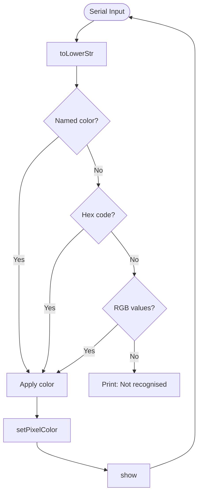
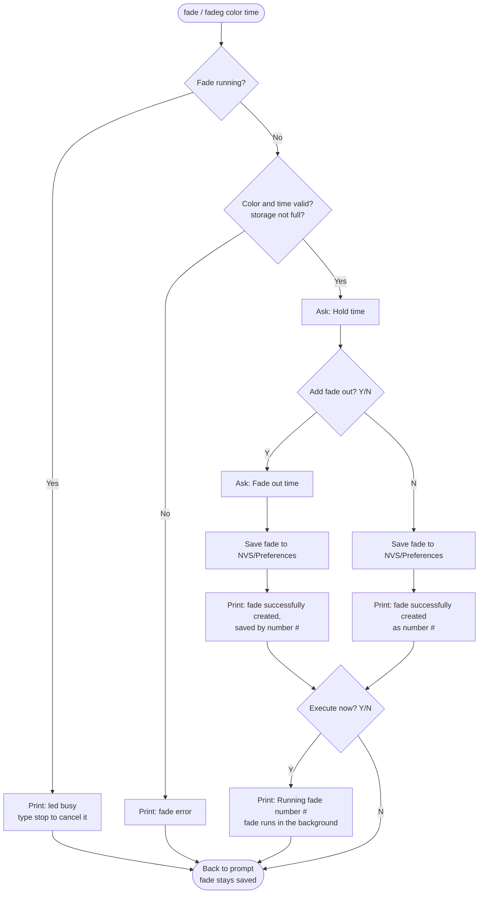
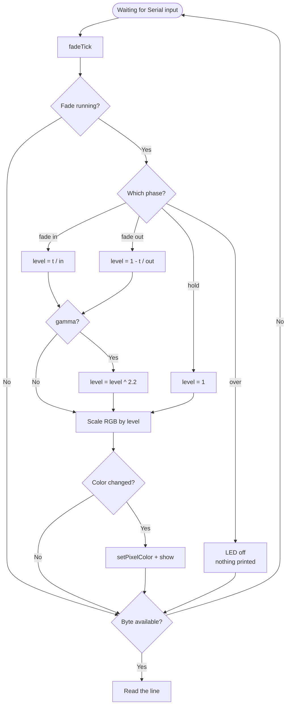
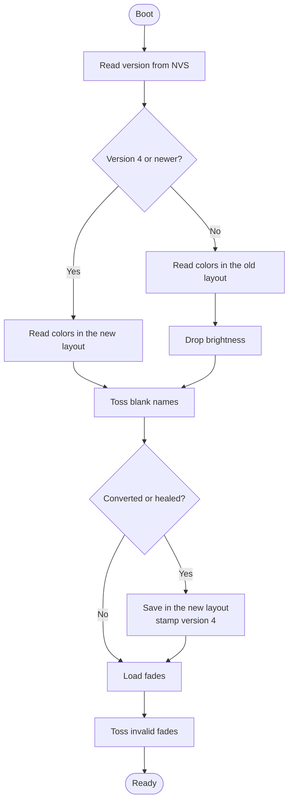
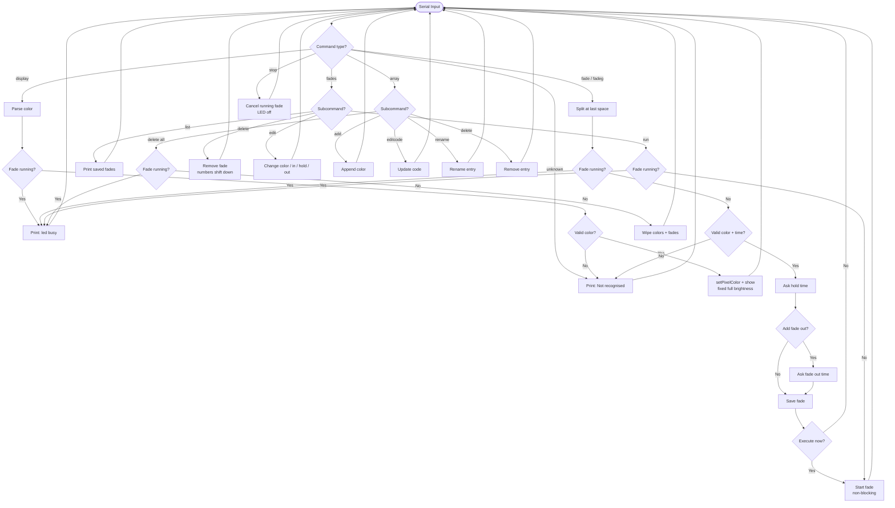

# 💡 Light Control Engine


> **A lightweight RGB lighting control engine for the ESP32-S3, operated entirely through a Serial interface.**

<picture>
  <source media="(prefers-color-scheme: dark)" srcset="https://github.com/user-attachments/assets/adacb953-3634-4590-8384-f0e306ec3d3a"">
  
</picture>

---

## 📑 Table of Contents

- [Overview](#overview)
- [Version 1.0 — Basic RGB Control](#-version-10--basic-rgb-control)
- [Version 2.0 — Named Colors & Hex Support](#-version-20--named-colors--hex-support)
- [Version 3.0 — Brightness & CLI](#-version-30--brightness--cli)
- [Version 4.0 — Fades](#-version-40--fades)
- [Configuration](#%EF%B8%8F-configuration)
- [Dependencies](#-dependencies)
- [Roadmap](#roadmap)
- [Contributing](#contributing)
- [License](#license)

---

## Overview

The ESP32-S3 onboard RGB LED is driven by a **single pin (GPIO 48)** using the NeoPixel protocol — no separate R/G/B pins required.

RGB color is represented by three channels, each ranging from `0` to `255`:

| Channel | Range | Description |
| ------- | ----- | ----------- |
| R       | 0–255 | Red         |
| G       | 0–255 | Green       |
| B       | 0–255 | Blue        |

Combined, this yields **16,777,216** possible colors (`256 × 256 × 256`).

The two core calls that drive the LED:

```c++
led.setPixelColor(0, led.Color(r, g, b));  // stage the color
led.show();                                 // apply it physically
```

---

## 🔴 Version 1.0 — Basic RGB Control

The first version establishes the foundation: read RGB values from Serial and apply them to the onboard LED.

**Input format:**

```
255 0 128
```

<details>
<summary><b>Flowchart view</b></summary>


```mermaid
flowchart TD
    A([Boot]) --> B[Init NeoPixel\nGPIO 48]
    B --> C[Wait for Serial input]
    C --> D[Parse R G B values]
    D --> E[setPixelColor]
    E --> F[show]
    F --> C
```

</details>

---

## 🎨 Version 2.0 — Named Colors & Hex Support

### Named Color Array

Instead of typing raw RGB codes, you can now input color names directly. Colors are mapped in a struct array:

```c++
NamedColor colors[] = {
  {"red",     255, 0,   0  },
  {"green",   0,   255, 0  },
  {"blue",    0,   0,   255} <- add comma here for another line
  // add more as needed
};
```

> [!TIP]
> You can extend the array with any custom color. Just follow the pattern — name, R, G, B.

### Hex Support

Standard hex color codes are also accepted:

```
#FF5500
#00FF88
```

### Case-Insensitive Input

All input is normalized to lowercase before parsing, so any of these work:

```
red / Red / RED / ReD
```

<details>
<summary><b>toLowerStr implementation</b></summary>

```c++
void toLowerStr(char* str) {
  for (int i = 0; str[i]; i++) {
    if (str[i] >= 'A' && str[i] <= 'Z') str[i] += 32;
  }
}
```

</details>

### Input Priority

When a command is received, the parser follows this resolution order:

```
named color → hex code → raw RGB values → "Not recognised"
```

<details>
<summary><b>Flowchart view</b></summary>


```mermaid
flowchart TD
    A([Serial Input]) --> B[toLowerStr]
    B --> C{Named color?}
    C -->|Yes| G[Apply color]
    C -->|No| D{Hex code?}
    D -->|Yes| G
    D -->|No| E{RGB values?}
    E -->|Yes| G
    E -->|No| F[Print: Not recognised]
    G --> H[setPixelColor]
    H --> I[show]
    I --> A
```

</details>

---

## 🔆 Version 3.0 — Brightness & CLI

> [!WARNING]
> Brightness was **removed in 4.0**. The brightness parts of this section are kept as history only and are marked below. See [Brightness removal](#-brightness-removal) in the 4.0 section.

### Brightness Control

Brightness was handled by the NeoPixel library directly, independent of the color channels.

> [!NOTE]
> Brightness and color were separate concerns. `setBrightness(100)` with `(255, 255, 255)` kept the color value intact for future reference, unlike manually scaling down the RGB values.

**Input format (removed in 4.0):**

```
brightness 180
```

<details>
<summary><b>Brightness implementation (removed in 4.0)</b></summary>

```++
if (!found && strncmp(input, "brightness ", 11) == 0) {
  int val = atoi(input + 11);
  val = constrain(val, 0, 255);
  rgbLed.setBrightness(val);
  rgbLed.show();
  Serial.print("Brightness set to: ");
  Serial.println(val);
  found = true;
}
```

</details>

> [!WARNING]
> Brightness values were not persisted across resets. The LED returned to default brightness on reboot.

### CLI Commands

> [!WARNING]
> Commands are case-sensitive and do not use the same normalisation as color names. Type them exactly as shown.

| Command        | Arguments                  | Description                   |
| -------------- | -------------------------- | ----------------------------- |
| `display`      | rgb code, hex code or name | Set the LED color             |
| `array add`    | name r g b                 | Add a new named color         |
| `array edit`   | name r g b                 | Edit an existing color        |
| `array rename` | old-name new-name          | Rename a color entry          |
| `array delete` | name                       | Remove a color from the array |

> [!IMPORTANT]
> Full CLI reference is documented in a separate file: [cli.md](cli.md).

<details>
<summary><b>Full input flowchart (3.0, brightness branch removed in 4.0)</b></summary>


```mermaid
flowchart TD
    A([Serial Input]) --> B{Command type?}
    B -->|display| C[Parse input]
    B -->|array| D[Parse array subcommand]
    B -->|brightness| E[Parse brightness value]
    B -->|unknown| F[Print: Not recognised]

    C --> G[toLowerStr]
    G --> H{Named color?}
    H -->|Yes| L[Apply color]
    H -->|No| I{Hex code?}
    I -->|Yes| L
    I -->|No| J{RGB values?}
    J -->|Yes| L
    J -->|No| F

    D --> K{Subcommand?}
    K -->|add| M[Append to array]
    K -->|edit| N[Update entry]
    K -->|rename| O[Rename entry]
    K -->|delete| P[Remove entry]

    E --> Q[constrain 0–255]
    Q --> R[setBrightness]
    R --> S[show]

    L --> T[setPixelColor]
    T --> S
    S --> A
```

</details>

---

## 🌅 Version 4.0 — Fades

4.0 adds the **effects CLI**, starting with **fades**: the LED goes from off up to a color, stays lit for a while, and optionally goes back down to off. It also removes brightness completely.

### What's new

| Command  | Arguments                          | Description                                       |
| -------- | ---------------------------------- | ------------------------------------------------- |
| `fade`   | color, fade in time                | Create a fade with a normal (linear) curve        |
| `fadeg`  | color, fade in time                | Same as `fade`, with gamma correction             |
| `fades`  | `list`, `run`, `delete`, `edit`    | List and manage the saved fades                   |
| `stop`   | none                               | Cancel the running fade, LED off immediately      |

Also new: `display` and `array add` lost their brightness steps, and saved colors from 3.0 are migrated automatically.

### Creating a fade

```
fade [name | rgb(r g b) | #hex] [fade in time]
```

The color is accepted exactly like `display`: a name, `rgb(r g b)` or `#hex`. The command line is split at the **last space**: the last word is the fade in time, everything before it is the color. That is why `rgb(255 0 128)` works even with spaces inside it.

```
> fade rgb(255 0 128) 2s
Hold time (how long it stays lit, e.g. 2s): 1s
Add fade out? Y/N: Y
Fade out time: 1.5s
fade successfully created, saved by number 0
Execute now? Y/N: Y
Running fade number 0
```

Without a fade out:

```
> fade red 1.5s
Hold time (how long it stays lit, e.g. 2s): 2s
Add fade out? Y/N: N
fade successfully created as number 1
Execute now? Y/N: N
```

> [!NOTE]
> The hold time is asked right after the command and **before** "Add fade out?". If you answer `N` to the fade out, the hold still applies: fade in → hold → the LED turns off instantly.

`back` and `esc` work in every prompt of the flow, same as the rest of the CLI.

<details>
<summary><b>Creation flowchart</b></summary>


```mermaid
flowchart TD
    A([fade / fadeg color time]) --> B{Fade running?}
    B -->|Yes| BUSY[Print: led busy\ntype stop to cancel it]
    B -->|No| C{Color and time valid?\nstorage not full?}
    C -->|No| ERR[Print: fade error]
    C -->|Yes| D[Ask: Hold time]
    D --> E{Add fade out? Y/N}
    E -->|Y| F[Ask: Fade out time]
    F --> G[Save fade to NVS/Preferences]
    G --> H[Print: fade successfully created,\nsaved by number #]
    E -->|N| I[Save fade to NVS/Preferences]
    I --> J[Print: fade successfully created\nas number #]
    H --> K{Execute now? Y/N}
    J --> K
    K -->|Y| L[Print: Running fade number #\nfade runs in the background]
    K -->|N| M([Back to prompt\nfade stays saved])
    L --> M
    BUSY --> M
    ERR --> M
```

</details>

### Fade shape


```mermaid
flowchart LR
    A([Off]) -->|fade in| B[Full color]
    B -->|hold| C[Full color]
    C -->|fade out| D([Off])
    C -.->|no fade out| E([Off, instantly])
```

| Phase    | What happens                                          | Time                |
| -------- | ----------------------------------------------------- | ------------------- |
| Fade in  | Always starts from black, goes up to the color        | typed in the command |
| Hold     | LED stays at full color                               | asked after the command (can be `0s`) |
| Fade out | Color goes back down to black (optional)              | asked if you answer `Y` |

> [!NOTE]
> You can't fade to black (`off`, `rgb(0 0 0)`, `#000000`). There is nothing to fade to, so it returns an error.

### Time format

Times **need a suffix**: `1.5s` or `1500ms`. No suffix is an error.

| Input    | Result                              |
| -------- | ----------------------------------- |
| `1.5s`   | 1500 ms                             |
| `1500ms` | 1500 ms                             |
| `2s`     | 2000 ms                             |
| `2`      | error: invalid time (no suffix)     |
| `3601s`  | error: time too long (max `3600s`)  |

The max time is **3600s (1h)** per phase. Fade in and fade out can't be `0`; hold can.

### Gamma correction

`fade` uses a normal (linear) curve, `fadeg` uses gamma correction. Same flow, same prompts, same saving — only the curve changes, and it is saved with the fade.

```
linear: level = t
gamma:  level = t ^ 2.2
```

`level` goes from `0` to `1` during the fade in (and back down during the fade out), and each channel is `color × level`. The exponent is `FADE_GAMMA` in the code.

> [!TIP]
> Human eyes don't see brightness linearly, so a linear fade tends to look like it lights up quickly and then barely changes. Try `fadeg` if that bugs you.

Gamma graph:

<picture>
  <source media="(prefers-color-scheme: dark)" srcset="https://github.com/user-attachments/assets/5942a7c6-e956-4a36-b47f-62d092cf5b05">
  
</picture>

### Managing fades

```
fades [function]
```

| Function | Description                                                        |
| -------- | ------------------------------------------------------------------ |
| `list`   | Shows every saved fade: number, color, curve, in, hold and out     |
| `run`    | Runs a saved fade                                                  |
| `delete` | Deletes a saved fade                                               |
| `edit`   | Edits the color or one of the times of a saved fade                |

`run`, `delete` and `edit` accept the number inline (`fades run 2`) or ask for it (after showing the list).

```
> fades list
--- fade list ---
0. (255 0 128) linear | in 2s | hold 1s | out 1500ms
1. (255 0 0) linear | in 1500ms | hold 2s | out none
-----------------
```

`fades edit` asks what to edit: `color`, `in`, `hold` or `out`. For `out`, type `none` to remove the fade out. The curve can't be edited, it comes from the command that created the fade (`fade` or `fadeg`).

Fades are numbered from `0`, and the numbers **shift down** after a delete (same as the color array).

### Non-blocking engine and the stop/lock rule

The fade runs **in the background**: the CLI keeps working while the LED is animating. There is no timer or second task, the engine is stepped from the same loop that waits for your input (`fadeTick()` is called inside `readLine()`), so it ticks about once per millisecond while the CLI is idle or waiting at a prompt.

While a fade is running:

| Command                                                   | State                                    |
| --------------------------------------------------------- | ---------------------------------------- |
| `stop`                                                    | Cancels the fade                         |
| `display`, `fade`, `fadeg`, `fades run`, `delete all`     | **Blocked** until the fade ends or `stop` |
| `array add / delete / editcode / rename`, `fades list / delete / edit` | Work normally               |
| `esc`, `back`                                             | Navigation only, they do **not** cancel  |

Blocked commands return `led busy: a fade is running, type stop to cancel it`.

`stop` turns the LED off immediately and the fade **stays saved**. When a fade ends by itself, the LED turns off and nothing is printed.

> [!NOTE]
> The running fade is a copy. Deleting or editing the saved fade while it runs doesn't change the one that's playing.

<details>
<summary><b>Engine flowchart</b></summary>


```mermaid
flowchart TD
    A([Waiting for Serial input]) --> B[fadeTick]
    B --> C{Fade running?}
    C -->|No| D{Byte available?}
    C -->|Yes| E{Which phase?}
    E -->|fade in| F[level = t / in]
    E -->|hold| G[level = 1]
    E -->|fade out| H[level = 1 - t / out]
    E -->|over| I[LED off\nnothing printed]
    F --> J{gamma?}
    H --> J
    J -->|Yes| K[level = level ^ 2.2]
    J -->|No| L[Scale RGB by level]
    K --> L
    G --> L
    L --> M{Color changed?}
    M -->|Yes| N[setPixelColor + show]
    M -->|No| D
    N --> D
    I --> D
    D -->|No| A
    D -->|Yes| O[Read the line]
```

</details>

### Storage

Saved fades **persist** in NVS/Preferences, like the custom colors (namespace `lce`). They survive resets and reflashes, and `delete all` wipes them together with the colors.

| Item            | Limit / detail                          |
| --------------- | --------------------------------------- |
| Saved fades     | **30 max** (`MAX_FADES`), then `fade error: storage full` |
| Fade number     | Starts at `0`, shifts down after a delete |
| What is saved   | Color (RGB), curve, fade in, hold, fade out (if any) |
| Bad entries     | Invalid saved fades are tossed on boot (self healing) |

### ❌ Brightness removal

**Brightness was removed from the whole system in 4.0.** It only caused problems, so it is gone:

- no brightness field in the color struct
- no "Want to define brightness?" question in `display`
- no brightness step in `array add`
- no `brightness` command
- the LED always runs at fixed full brightness (`255`); a fade scales the RGB values from `0` up to the color

> [!TIP]
> **Want it dimmer? Use lower RGB values.** `rgb(255 0 0)` is full red, `rgb(60 0 0)` is a dim red, `rgb(20 20 20)` is a dim white. For a fade, pick the dimmer color and fade to that.

If you add default colors in the code, they are `{name, r, g, b}` now, without the 4th number the older examples had.

### 🔄 Migration from 3.0

Colors saved by 3.0 use the old layout (with brightness). **You don't lose them.** On the first boot of 4.0:

1. The old entries are read in the old layout.
2. They are converted to the new layout, the brightness just gets dropped.
3. Everything is saved again in the new layout and the storage is stamped as 4.0, so this only happens once.
4. If there were colors to convert, the boot prints `saved colors converted to the 4.0 layout, brightness dropped`.

Blank-name entries are still tossed during this step, same self healing as before.

<details>
<summary><b>Migration flowchart</b></summary>


```mermaid
flowchart TD
    A([Boot]) --> B[Read version from NVS]
    B --> C{Version 4 or newer?}
    C -->|Yes| D[Read colors in the new layout]
    C -->|No| E[Read colors in the old layout]
    E --> F[Drop brightness]
    D --> G[Toss blank names]
    F --> G
    G --> H{Converted or healed?}
    H -->|Yes| I[Save in the new layout\nstamp version 4]
    H -->|No| J[Load fades]
    I --> J
    J --> K[Toss invalid fades]
    K --> L([Ready])
```

</details>

### Full input flowchart (4.0)

<details>
<summary><b>Flowchart view</b></summary>


```mermaid
flowchart TD
    A([Serial Input]) --> B{Command type?}
    B -->|display| C[Parse color]
    B -->|fade / fadeg| D[Split at last space]
    B -->|fades| E{Subcommand?}
    B -->|array| F{Subcommand?}
    B -->|stop| G[Cancel running fade\nLED off]
    B -->|unknown| H[Print: Not recognised]

    C --> BUSY1{Fade running?}
    BUSY1 -->|Yes| BUSY[Print: led busy]
    BUSY1 -->|No| C2{Valid color?}
    C2 -->|Yes| APPLY[setPixelColor + show\nfixed full brightness]
    C2 -->|No| H

    D --> BUSY2{Fade running?}
    BUSY2 -->|Yes| BUSY
    BUSY2 -->|No| D2{Valid color + time?}
    D2 -->|No| H
    D2 -->|Yes| D3[Ask hold time]
    D3 --> D4{Add fade out?}
    D4 -->|Yes| D5[Ask fade out time]
    D4 -->|No| D6[Save fade]
    D5 --> D6
    D6 --> D7{Execute now?}
    D7 -->|Yes| RUN[Start fade\nnon-blocking]
    D7 -->|No| A

    E -->|list| E1[Print saved fades]
    E -->|run| E2{Fade running?}
    E2 -->|Yes| BUSY
    E2 -->|No| RUN
    E -->|delete| E3[Remove fade\nnumbers shift down]
    E -->|edit| E4[Change color / in / hold / out]

    F -->|add| F1[Append color]
    F -->|editcode| F2[Update code]
    F -->|rename| F3[Rename entry]
    F -->|delete| F4[Remove entry]
    F -->|delete all| F5{Fade running?}
    F5 -->|Yes| BUSY
    F5 -->|No| F6[Wipe colors + fades]

    APPLY --> A
    RUN --> A
    G --> A
    H --> A
    BUSY --> A
    E1 --> A
    E3 --> A
    E4 --> A
    F1 --> A
    F2 --> A
    F3 --> A
    F4 --> A
    F6 --> A
```

</details>

> [!IMPORTANT]
> The full CLI reference for 4.0 is in [cli.md](cli.md).

---

## ⚙️ Configuration

```cpp
#define LED_PIN      48        // Onboard NeoPixel pin
#define LED_COUNT    1         // Number of LEDs
#define NAME_LEN     32        // Max length of a color name (with the terminator)
#define MAX_CUSTOM   20        // Max custom colors
#define MAX_FADES    30        // Max saved fades
#define MAX_TIME_MS  3600000UL // Longest time you can type (1h)
#define FADE_GAMMA   2.2       // Gamma exponent used by fadeg
```

The Serial baud rate is `115200`, set directly in `setup()`.

> [!TIP]
> `MAX_CUSTOM` and `MAX_FADES` can be changed freely.

> [!CAUTION]
> Changing `NAME_LEN` after you already saved colors changes the saved layout and can make old entries unreadable. If that happens, `array delete all` gets you back to a clean state.

---

## 📦 Dependencies

- [Adafruit NeoPixel](https://github.com/adafruit/Adafruit_NeoPixel) — LED driver
- `Preferences` — NVS storage, included in the ESP32 Arduino core

> [!IMPORTANT]
> Library versions are not pinned. If a dependency updates and breaks the build, lock versions in your package manager.

---

## Roadmap

> [!NOTE]
> Items marked ✅ or 🚧 are (partly) implemented. Everything else is a planning list for future versions, not current behavior.

| Milestone | Target                                                        | Status         |
| :-------: | :------------------------------------------------------------ | :------------: |
| M1        | Persist colors in EEPROM/NVS (survives reboot)                | ✅ Done         |
| M2        | Support for multiple LEDs / addressable WS2812 strips         | 🔲 Planned      |
| M3        | Animation effects (fade, rainbow, blink)                      | 🚧 In progress  |
| M4        | Save/load custom color array via Serial command               | 🔲 Planned      |
| M5        | Control over WiFi/MQTT (in addition to Serial)                | 🔲 Planned      |

M1 landed in 3.0 (colors persist; brightness was removed in 4.0). M3 started with fades in 4.0, rainbow and blink are still to come.

---

## Contributing

Contributions are very welcome — new color modes, CLI improvements, docs, anything.

1. Fork the repo
2. Create a feature branch: `git checkout -b feat/your-feature`
3. Commit your changes: `git commit -m "feat: describe your change"`
4. Push and open a Pull Request against `main`

Please open an issue first for anything larger than a bug fix, so we can discuss direction before you invest time building it.

> [!IMPORTANT]
> When contributing firmware changes, always test on real hardware before submitting a PR. Serial timing and LED/fade behavior can differ from simulated builds.

---

## License

This project is licensed under the **MIT License**. See [LICENSE](./LICENSE) for the full text.
