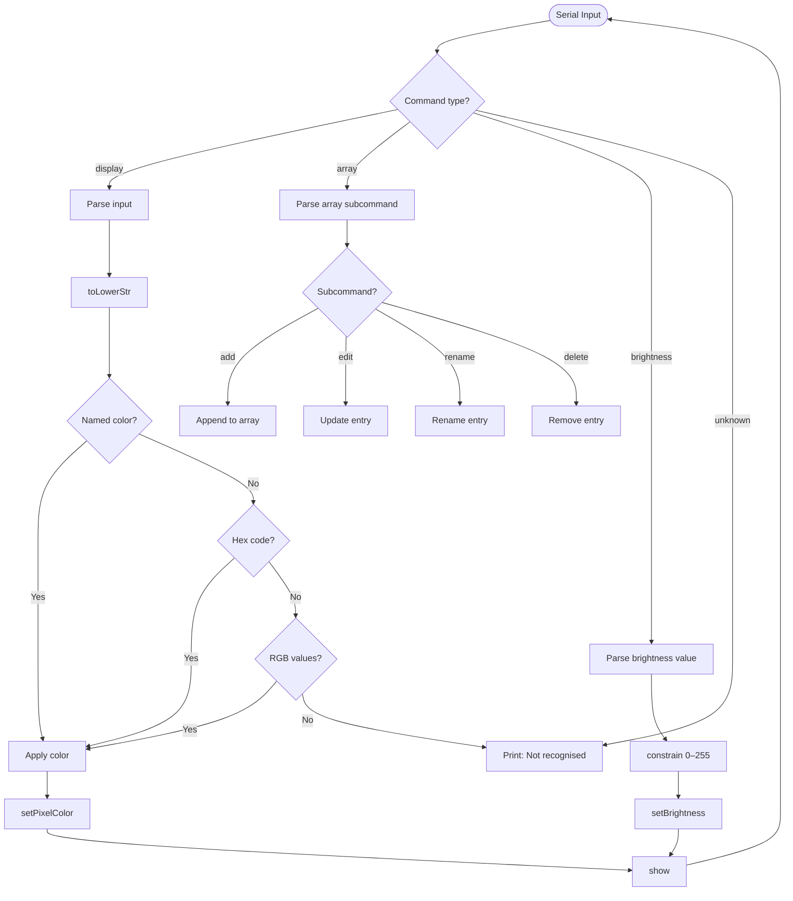

# 💡 Light Control Engine


> **A lightweight RGB lighting control engine for the ESP32-S3, operated entirely through a Serial interface.**

<picture>
  <source media="(prefers-color-scheme: dark)" srcset="https://github.com/user-attachments/assets/b4f4baac-342b-40a1-9ed0-3bb18b507f26">
  <source media="(prefers-color-scheme: light)" srcset="https://github.com/user-attachments/assets/f1a5fe65-339a-4f74-b0fc-78669dc42ed9">
  
</picture>

---

## 📑 Table of Contents

- [Overview](#overview)
- [Version 3.0 — Brightness & CLI](#-version-30--brightness--cli)
- [Configuration](#️-configuration)
- [Dependencies](#-dependencies)
- [Roadmap](#roadmap)
- [Contributing](#contributing)
- [License](#license)

---

## Overview

The ESP32-S3 onboard RGB LED is driven by a **single pin (GPIO 48)** using the NeoPixel protocol — no separate R/G/B pins required.

RGB color is represented by three channels, each ranging from `0` to `255`:

| Channel | Range | Description |
| --- | --- | --- |
| R | 0–255 | Red |
| G | 0–255 | Green |
| B | 0–255 | Blue |

Combined, this yields **16,777,216** possible colors (`256 × 256 × 256`).

The two core calls that drive the LED:

```cpp
led.setPixelColor(0, led.Color(r, g, b));  // stage the color
led.show();                                 // apply it physically
```

---

## 🔆 Version 3.0 — Brightness & CLI

### Brightness Control

Brightness is handled by the NeoPixel library directly, independent of the color channels.

> [!NOTE]
> Brightness and color are separate concerns. `setBrightness(100)` with `(255, 255, 255)` keeps the color value intact for future reference, unlike manually scaling down the RGB values.

**Input format:**
```
brightness 180
```

<details>
<summary>Brightness implementation</summary>

```cpp
if (!found && strncmp(input, "brightness ", 11) == 0) {
  int val = atoi(input + 11);
  val = constrain(val, 0, 255);
  rgbLed.setBrightness(val);
  rgbLed.show();
  Serial.print("Brightness set to: ");
  Serial.println(val);
  found = true;
}
```

</details>

> [!WARNING]
> Brightness values are not persisted across resets. The LED returns to default brightness on reboot. (Tracked in [Roadmap](#roadmap).)

### CLI Commands

> [!WARNING]
> Commands are case-sensitive and do not use the same normalisation as color names. Type them exactly as shown.

| Command | Arguments | Description |
| --- | --- | --- |
| `display` | rgb code, hex code or name | Set the LED color |
| `array add` | name r g b | Add a new named color |
| `array edit` | name r g b | Edit an existing color |
| `array rename` | old-name new-name | Rename a color entry |
| `array delete` | name | Remove a color from the array |

> [!IMPORTANT]
> Full CLI reference is documented in a separate file.

<details>
<summary>Full input flowchart</summary>


```mermaid
flowchart TD
    A([Serial Input]) --> B{Command type?}
    B -->|display| C[Parse input]
    B -->|array| D[Parse array subcommand]
    B -->|brightness| E[Parse brightness value]
    B -->|unknown| F[Print: Not recognised]

    C --> G[toLowerStr]
    G --> H{Named color?}
    H -->|Yes| L[Apply color]
    H -->|No| I{Hex code?}
    I -->|Yes| L
    I -->|No| J{RGB values?}
    J -->|Yes| L
    J -->|No| F

    D --> K{Subcommand?}
    K -->|add| M[Append to array]
    K -->|edit| N[Update entry]
    K -->|rename| O[Rename entry]
    K -->|delete| P[Remove entry]

    E --> Q[constrain 0–255]
    Q --> R[setBrightness]
    R --> S[show]

    L --> T[setPixelColor]
    T --> S
    S --> A
```

</details>

---

## ⚙️ Configuration

```cpp
#define LED_PIN        48     // Onboard NeoPixel pin
#define LED_COUNT      1      // Number of LEDs
#define BAUD_RATE      115200 // Serial baud rate
#define DEFAULT_BRIGHT 50     // Initial brightness (0–255)
```

> [!CAUTION]
> Setting brightness above 200 for extended periods may cause the onboard LED to heat up. Keep it reasonable for continuous use.

---

## 📦 Dependencies

- [Adafruit NeoPixel](https://github.com/adafruit/Adafruit_NeoPixel) — LED driver

> [!IMPORTANT]
> Library versions are not pinned. If a dependency updates and breaks the build, lock versions in your package manager.

---

## Roadmap

> [!NOTE]
> None of the items below are implemented yet — this is a planning list for future versions, not current behavior.

| Milestone | Target | Status |
| :---: | :--- | :---: |
| M1 | Persist brightness/color in EEPROM/NVS (survives reboot) | 🔲 Planned |
| M2 | Support for multiple LEDs / addressable WS2812 strips | 🔲 Planned |
| M3 | Animation effects (fade, rainbow, blink) | 🔲 Planned |
| M4 | Save/load custom color array via Serial command | 🔲 Planned |
| M5 | Control over WiFi/MQTT (in addition to Serial) | 🔲 Planned |

---

## Contributing

Contributions are very welcome — new color modes, CLI improvements, docs, anything.

1. Fork the repo
2. Create a feature branch: `git checkout -b feat/your-feature`
3. Commit your changes: `git commit -m "feat: describe your change"`
4. Push and open a Pull Request against `main`

Please open an issue first for anything larger than a bug fix, so we can discuss direction before you invest time building it.

> [!IMPORTANT]
> When contributing firmware changes, always test on real hardware before submitting a PR. Serial timing and brightness/LED heat behavior can differ from simulated builds.

---

## License

This project is licensed under the **MIT License**. See [LICENSE](./LICENSE) for the full text.

---
