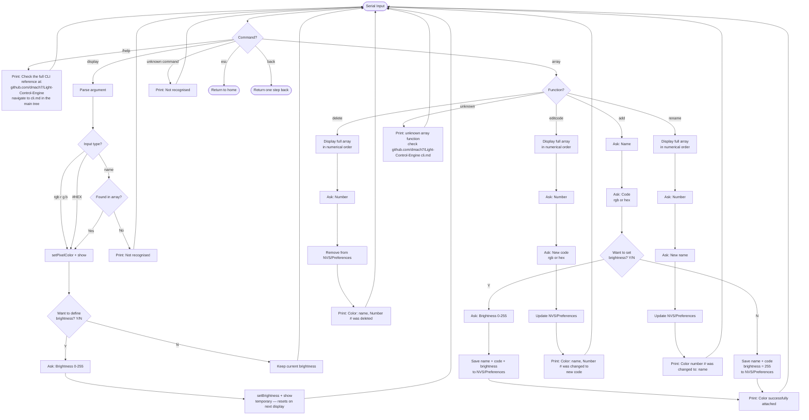

## This file only contains CLI commands of the project

### /help
serial input: /help
returns: "Check the full CLI reference at: https://github.com/dmach7/Light-Control-Engine — navigate to cli.md in the main tree"

### display
serial input: display [name | rgb(r g b) | #FFFFFF]
displays the color on the LED, does not save anything to the system
after displaying, system asks: "Want to define brightness? Y/N"
if Y: system asks "Brightness (0-255):" and applies
if N: keeps current brightness
brightness set this way is temporary and resets on next display command

examples:
display rgb(255 255 255)
display #FFFFFF
display green

### array
serial input: array [function]
available functions: add, delete, editcode, rename
colors persist in NVS/Preferences and survive resets

add: system asks for a name → then asks for a code (rgb or hex) → asks "Want to set brightness for this color? Y/N" → if Y asks "Brightness (0-255):" and saves alongside the color → if N saves with brightness 255 → returns "Color successfully attached"

delete: system displays full array in numerical order → asks for a number → returns "Color: name, Number # was deleted"

editcode: system displays full array in numerical order → asks for a number → asks for new code (rgb or hex) → returns "Color: name, Number # was changed to (### ### ###) or #xxxxxx"

rename: system displays full array in numerical order → asks for a number → asks for new name → returns "Color number # was changed to: name"

unknown function: returns "unknown array function, check https://github.com/dmach7/Light-Control-Engine cli.md"

### return

type esc to go back to home, type back to go back only one step

Flowchart view

