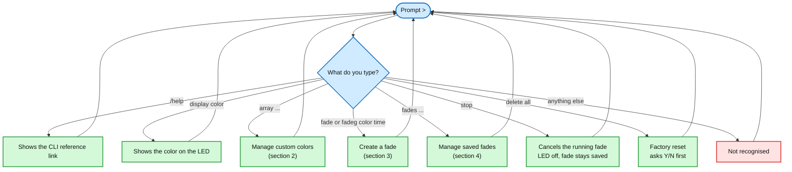
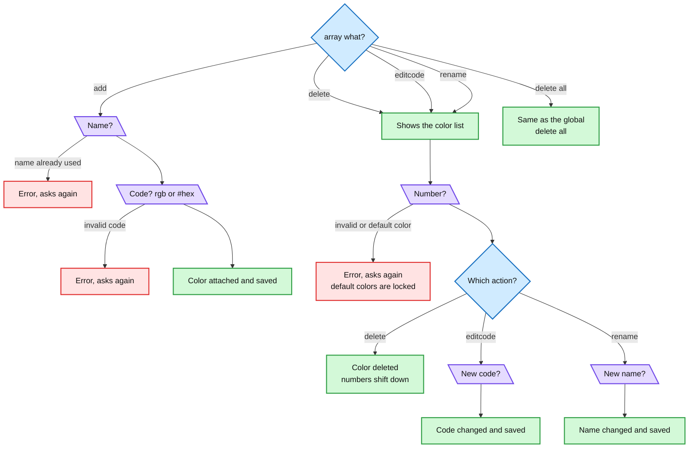
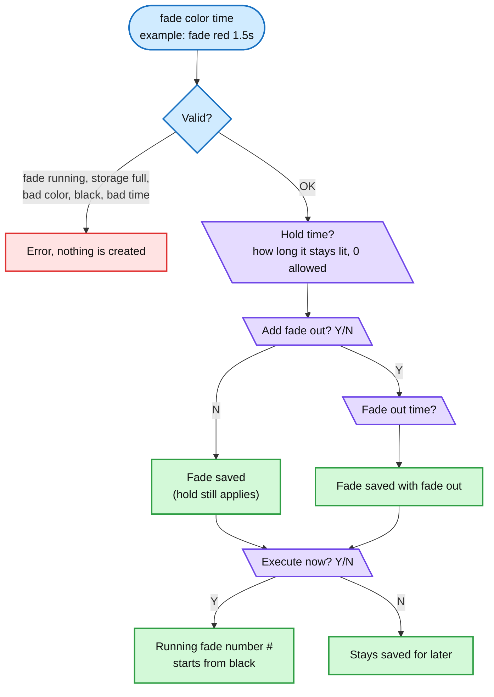
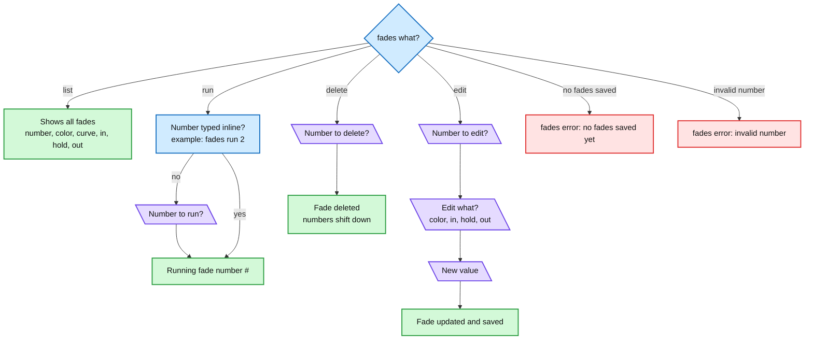
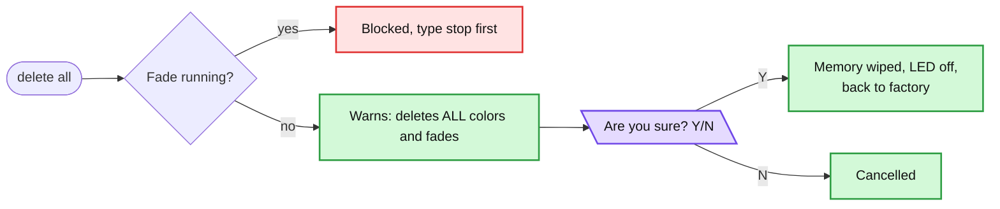

## This file only contains CLI commands of the project

### /help

serial input: /help
returns: "Check the full CLI reference at: <https://github.com/dmach7/Light-Control-Engine> — navigate to cli.md in the main tree"

### display

serial input: display [name | rgb(r g b) | #FFFFFF]
displays the color on the LED at full brightness, does not save anything to the system
there is no brightness question anymore, brightness was removed in 4.0 (want it dimmer? use lower rgb values)
blocked while a fade is running, returns: "led busy: a fade is running, type stop to cancel it"

examples:
display rgb(255 255 255)
display #FFFFFF
display green
display rgb(60 0 0)

### array

serial input: array [function]
available functions: add, delete, editcode, rename, delete all
colors persist in NVS/Preferences and survive resets

add: system asks for a name → then asks for a code (rgb or hex) → returns "Color successfully attached"

delete: system displays full array in numerical order → asks for a number → returns "Color: name, Number # was deleted"

editcode: system displays full array in numerical order → asks for a number → asks for new code (rgb or hex) → returns "Color: name, Number # was changed to (### ### ###)"

rename: system displays full array in numerical order → asks for a number → asks for new name → returns "Color number # was changed to: name"

delete all: system asks "Are you sure? Y/N" → if Y wipes ALL memory (custom colors and saved fades) and goes back to factory → returns "Memory wiped, back to factory"
also works as: delete all
blocked while a fade is running

unknown function: returns "unknown array function, check <https://github.com/dmach7/Light-Control-Engine> cli.md"

### fade

serial input: fade [name | rgb(r g b) | #hex] [fade in time]
creates a fade with a normal (linear) curve
the line is split at the LAST space: the last word is the fade in time, everything before it is the color (so rgb(255 0 128) works)
fade in always starts from black (off) and goes up to the color
times need a suffix: 1.5s or 1500ms, no suffix returns an error
max time is 3600s, fade in and fade out can't be 0, hold can
can't fade to black (off), there is nothing to fade to
blocked while a fade is running

after the command, system asks: "Hold time (how long it stays lit, e.g. 2s):"
then asks: "Add fade out? Y/N"
if Y: system asks "Fade out time:" → returns "fade successfully created, saved by number #"
if N: returns "fade successfully created as number #" (after the hold the LED turns off instantly, no fade out)
then asks: "Execute now? Y/N"
if Y: returns "Running fade number #" and the fade runs in the background, the CLI keeps working
if N: goes back to the prompt, the fade stays saved
the fade prints nothing when it ends by itself

max 30 saved fades, when full returns "fade error: storage full"
fades persist in NVS/Preferences and survive resets

examples:
fade red 1.5s
fade #FF5500 800ms
fade rgb(255 0 128) 2s
fade Goose Turd Green 1s

errors:
fade error: missing color and time
fade error: missing fade in time
fade error: color not recognised
fade error: invalid time, use a suffix like 1.5s or 1500ms
fade error: time too long, max is 3600s
fade error: time can't be 0
fade error: can't fade to black, pick another color
fade error: storage full

### fadeg

serial input: fadeg [name | rgb(r g b) | #hex] [fade in time]
same as fade (same prompts, same rules, same saving) but with gamma correction (exponent 2.2)
linear fades look like they jump at the start and sit at full color for too long, gamma looks smoother to the eye
the curve is saved with the fade, fades list shows it

example:
fadeg #00FF88 2s

### fades

serial input: fades [function]
available functions: list, run, delete, edit
fades are saved by number, numbers start at 0 and shift down after a delete (same as array)
run, delete and edit accept the number inline or ask for it

list: system displays all saved fades in numerical order → each line shows number, color, curve (linear or gamma), fade in, hold and fade out (none if there isn't one)
no fades saved returns "fades error: no fades saved yet"

run: fades run [number] → if no number, system displays the list and asks "Number to run:" → returns "Running fade number #" and the fade runs in the background
blocked while a fade is running

delete: fades delete [number] → if no number, system displays the list and asks "Number to delete:" → returns "Fade number # was deleted"
deleting the fade that is running does not stop it, only stop does

edit: fades edit [number] → if no number, system displays the list and asks "Number to edit:" → asks "Edit what? (color, in, hold, out):"
color: asks "New color (name, rgb(r g b) or #hex):" → returns "Fade number #: color was changed to (### ### ###)"
in: asks "New fade in time:" → returns "Fade number #: fade in was changed to time"
hold: asks "New hold time:" → returns "Fade number #: hold was changed to time"
out: asks "New fade out time (or none to remove it):" → returns "Fade number #: fade out was changed to time" or "Fade number #: fade out was removed"
the curve (fade or fadeg) can't be edited, it comes from the command that created the fade

unknown function: returns "unknown fades function, check <https://github.com/dmach7/Light-Control-Engine> cli.md"

examples:
fades list
fades run 2
fades delete 0
fades edit 1

### stop

serial input: stop
cancels the running fade: the LED turns off immediately and the fade stays saved
returns "Fade stopped", or "stop: nothing is running" if there is no fade running
while a fade is running ONLY stop cancels it, esc and back don't
while a fade is running these are blocked: display, fade, fadeg, fades run, delete all
everything else keeps working (array add, delete, editcode, rename, fades list, delete, edit)
blocked commands return "led busy: a fade is running, type stop to cancel it"

### return

type esc to go back to home, type back to go back only one step
back and esc are reserved, they can't be used as color names
they work in every prompt (hold time, Add fade out?, Execute now?, edit steps, array steps...)

<b>Flowchart view</b>

## Rules

| Topic | Rule |
| ----- | ---- |
| Colors | Name (default or custom), `#hex`, or `rgb(r g b)` |
| Times | Always with a suffix: `1.5s` or `1500ms`. Max `3600s` |
| `esc` | Works in every prompt, goes back to the menu |
| `back` | Works in every prompt, goes one step back |
| Fade running | `display`, `fade`, `fadeg`, `fades run` and `delete all` are blocked. Type `stop` to cancel it |
| Limits | 20 custom colors, 30 saved fades |
| Fades | Always start from black. You can't fade to black. `fade` = linear, `fadeg` = gamma |
| Saved data | Custom colors and fades survive a reboot |

## 1. Main menu

```mermaid
flowchart TD
    classDef cmd fill:#d0ebff,stroke:#1971c2,color:#111111,stroke-width:2px
    classDef out fill:#d3f9d8,stroke:#2f9e44,color:#111111,stroke-width:2px
    classDef err fill:#ffe3e3,stroke:#e03131,color:#111111,stroke-width:2px

    P(["Prompt >"]) --> C{"What do you type?"}
    C -->|"/help"| H["Shows the CLI reference link"]
    C -->|"display color"| D["Shows the color on the LED"]
    C -->|"array ..."| A["Manage custom colors<br/>(section 2)"]
    C -->|"fade or fadeg color time"| F["Create a fade<br/>(section 3)"]
    C -->|"fades ..."| FS["Manage saved fades<br/>(section 4)"]
    C -->|"stop"| S["Cancels the running fade<br/>LED off, fade stays saved"]
    C -->|"delete all"| W["Factory reset<br/>asks Y/N first"]
    C -->|"anything else"| U["Not recognised"]

    H --> P
    D --> P
    A --> P
    F --> P
    FS --> P
    S --> P
    W --> P
    U --> P

    class C,P cmd
    class H,D,A,F,FS,S,W out
    class U err
```

## 2. Custom colors (`array`)

```mermaid
flowchart TD
    classDef cmd fill:#d0ebff,stroke:#1971c2,color:#111111,stroke-width:2px
    classDef ask fill:#e5dbff,stroke:#7048e8,color:#111111,stroke-width:2px
    classDef out fill:#d3f9d8,stroke:#2f9e44,color:#111111,stroke-width:2px
    classDef err fill:#ffe3e3,stroke:#e03131,color:#111111,stroke-width:2px

    A{"array what?"}

    A -->|"add"| A1[\"Name?"\]
    A1 -->|"name already used"| E1["Error, asks again"]
    A1 --> A2[\"Code? rgb or #hex"\]
    A2 -->|"invalid code"| E2["Error, asks again"]
    A2 --> A3["Color attached and saved"]

    A -->|"delete"| L1["Shows the color list"]
    A -->|"editcode"| L1
    A -->|"rename"| L1
    L1 --> N[\"Number?"\]
    N -->|"invalid or default color"| E3["Error, asks again<br/>default colors are locked"]
    N --> ACT{"Which action?"}
    ACT -->|"delete"| R1["Color deleted<br/>numbers shift down"]
    ACT -->|"editcode"| R2[\"New code?"\] --> R2o["Code changed and saved"]
    ACT -->|"rename"| R3[\"New name?"\] --> R3o["Name changed and saved"]

    A -->|"delete all"| W["Same as the global<br/>delete all"]

    class A,ACT cmd
    class A1,A2,N,R2,R3 ask
    class A3,R1,R2o,R3o,L1,W out
    class E1,E2,E3 err
```

> [!NOTE]
> `delete`, `editcode` and `rename` say "no custom colors yet" if you haven't added any.

## 3. Creating a fade (`fade` / `fadeg`)

```mermaid
flowchart TD
    classDef cmd fill:#d0ebff,stroke:#1971c2,color:#111111,stroke-width:2px
    classDef ask fill:#e5dbff,stroke:#7048e8,color:#111111,stroke-width:2px
    classDef out fill:#d3f9d8,stroke:#2f9e44,color:#111111,stroke-width:2px
    classDef err fill:#ffe3e3,stroke:#e03131,color:#111111,stroke-width:2px

    S(["fade color time<br/>example: fade red 1.5s"]) --> CHK{"Valid?"}
    CHK -->|"fade running, storage full,<br/>bad color, black, bad time"| E["Error, nothing is created"]
    CHK -->|"OK"| H[\"Hold time?<br/>how long it stays lit, 0 allowed"\]
    H --> O[\"Add fade out? Y/N"\]
    O -->|"Y"| OT[\"Fade out time?"\]
    O -->|"N"| SV["Fade saved<br/>(hold still applies)"]
    OT --> SV2["Fade saved with fade out"]
    SV --> X[\"Execute now? Y/N"\]
    SV2 --> X
    X -->|"Y"| R["Running fade number #<br/>starts from black"]
    X -->|"N"| K["Stays saved for later"]

    class S,CHK cmd
    class H,O,OT,X ask
    class SV,SV2,R,K out
    class E err
```

Phases of a fade: **fade in** → **hold** → **fade out** (optional). Without a fade out, the LED turns off right after the hold. Nothing is printed when a fade ends.

## 4. Saved fades (`fades`)

```mermaid
flowchart TD
    classDef cmd fill:#d0ebff,stroke:#1971c2,color:#111111,stroke-width:2px
    classDef ask fill:#e5dbff,stroke:#7048e8,color:#111111,stroke-width:2px
    classDef out fill:#d3f9d8,stroke:#2f9e44,color:#111111,stroke-width:2px
    classDef err fill:#ffe3e3,stroke:#e03131,color:#111111,stroke-width:2px

    F{"fades what?"}

    F -->|"list"| L["Shows all fades<br/>number, color, curve, in, hold, out"]

    F -->|"run"| R1["Number typed inline?<br/>example: fades run 2"]
    R1 -->|"no"| R2[\"Number to run?"\]
    R1 -->|"yes"| R3["Running fade number #"]
    R2 --> R3

    F -->|"delete"| D1[\"Number to delete?"\] --> D2["Fade deleted<br/>numbers shift down"]

    F -->|"edit"| E1[\"Number to edit?"\]
    E1 --> E2[\"Edit what?<br/>color, in, hold, out"\]
    E2 --> E3[\"New value"\]
    E3 --> E4["Fade updated and saved"]

    F -->|"no fades saved"| NF["fades error: no fades saved yet"]
    F -->|"invalid number"| IN["fades error: invalid number"]

    class F,R1 cmd
    class R2,D1,E1,E2,E3 ask
    class L,R3,D2,E4 out
    class NF,IN err
```

> [!TIP]
> For `run`, `delete` and `edit` you can type the number right away (`fades delete 3`) or leave it out and the CLI asks for it.
> For `out` in `fades edit`, type `none` to remove the fade out.
> Deleting or editing a fade while it runs doesn't stop it. The running fade is a copy and keeps playing.

## 5. Factory reset (`delete all`)

```mermaid
flowchart LR
    classDef ask fill:#e5dbff,stroke:#7048e8,color:#111111,stroke-width:2px
    classDef out fill:#d3f9d8,stroke:#2f9e44,color:#111111,stroke-width:2px
    classDef err fill:#ffe3e3,stroke:#e03131,color:#111111,stroke-width:2px

    S(["delete all"]) --> B{"Fade running?"}
    B -->|"yes"| E["Blocked, type stop first"]
    B -->|"no"| W["Warns: deletes ALL colors and fades"]
    W --> Q[\"Are you sure? Y/N"\]
    Q -->|"Y"| OK["Memory wiped, LED off,<br/>back to factory"]
    Q -->|"N"| C["Cancelled"]

    class Q ask
    class OK,C,W out
    class E err
```

## Legend

| Color | Meaning |
| ----- | ------- |
| 🟦 Blue | Command or decision |
| 🟪 Purple | The CLI asks you something and waits |
| 🟩 Green | Normal result |
| 🟥 Red | Error or blocked |

